基本架构和环境

* `基本惯例`_

  * `比特和字节序`_
  * `指令操作数`_
  * `数值表示`_
  * `分段寻址`_
  * `CPUID/CR/MSR 新语法`_
  * `异常`_

* `执行环境`_

  * `操作模式`_
  * `环境概览`_
  * `内存组织`_
  * `基本寄存器`_
  * `操作数大小`_
  * `操作数寻址`_

* `数据类型`_

  * `基本类型`_
  * `数值类型`_
  * `指针类型`_
  * `位域类型`_
  * `字符串类型`_
  * `SIMD 类型`_
  * `BCD 类型`_
  * `实数和浮点格式`_
  * `浮点异常`_

* `过程调用`_

基本惯例
=========

比特和字节序
------------

在内存数据结构的示意图中，较小的地址出现在图的底部，地址向顶部增加。比特位位置从右到左编
号，一个比特的置位后的数值等于对应位置的 2 次幂。Intel 64 和 IA-32 处理器是小端字节序
机器，这意味着一个字长中的字节编号从位于最低地址的最低字节开始。

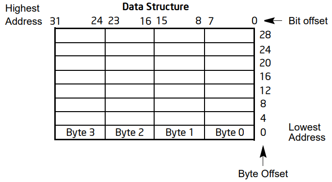

指令操作数
----------

当指令以符号形式表示时，使用的是 IA-32 汇编语言的一个子集。在这个子集中，指令具有以下格
式： ::

    label: mnemonic argument1, argument2, argument3

标签（label）
    是一个标识符，后面跟一个冒号
助记符（mnemonic）
    是具有相同功能的一类指令操作码的助记名称
操作数（operands）
    操作数 argument1, argument2, argument3 是可选的。根据操作码，操作数可能从零到三个
    不等。当存在时，它们可以是字面量或者数据项的标识符。操作数标识符要么是寄存器名称，要
    么是被关联到在程序其他部分声明的数据项。

当算术或逻辑指令中存在两个操作数时，右操作数是源操作数，左操作数是目标操作数。例如： ::

    LOADREG: MOV EAX, SUBTOTAL

在这个例子中，LOADREG 是一个标签，MOV 是操作码的助记标识符，EAX 是目标操作数，SUBTOTAL
是源操作数。一些汇编语言可能会将源和目标操作数的顺序颠倒。

数值表示
---------

十六进制（基数 16）数是由一串十六进制数字组成的字符串，后面紧跟字符 'H'（例如 0F82EH）。
十六进制数字包括以下字符集：0, 1, 2, 3, 4, 5, 6, 7, 8, 9, A, B, C, D, E, 和 F。

二进制（基数 2）数是由一串 1 和 0 组成的字符串，有时后面跟着字符 'B'（例如，1010B）。
字符标识 'B' 仅在可能对数字类型产生混淆的情况下使用。

分段寻址
---------

处理器使用字节寻址，这意味着内存以字节序列组织和访问。无论正在访问一个字节还是多个字节，
都使用字节地址来定位内存中的字节或字节序列。可以寻址的内存范围称为地址空间。

处理器还支持分段寻址。这是一种寻址形式，程序可能拥有许多独立的地址空间，称为段。例如，程
序可以将代码（指令）和程序栈保存在不同的段中。代码的地址将始终引用代码段空间，程序栈的地
址将始终引用栈段空间。以下符号用于指定段内的字节地址： ::

    segment-register:byte-address

例如，以下段地址标识了 DS 寄存器指向的段中地址 FF79H 处的字节： ::

    DS:FF79H

以下段地址标识了代码段中的指令地址，CS 寄存器指向代码段，EIP 寄存器包含指令的地址： ::

    CS:EIP

CPUID/CR/MSR 新语法
--------------------

获取 CPU 特性标志、状态和系统信息可以通过使用 CPUID 指令、检查控制寄存器（CR）标志位以
及读取 MSR 寄存器来实现。为了更清晰地表示这些信息，我们正在采用一种新的语法。如下：

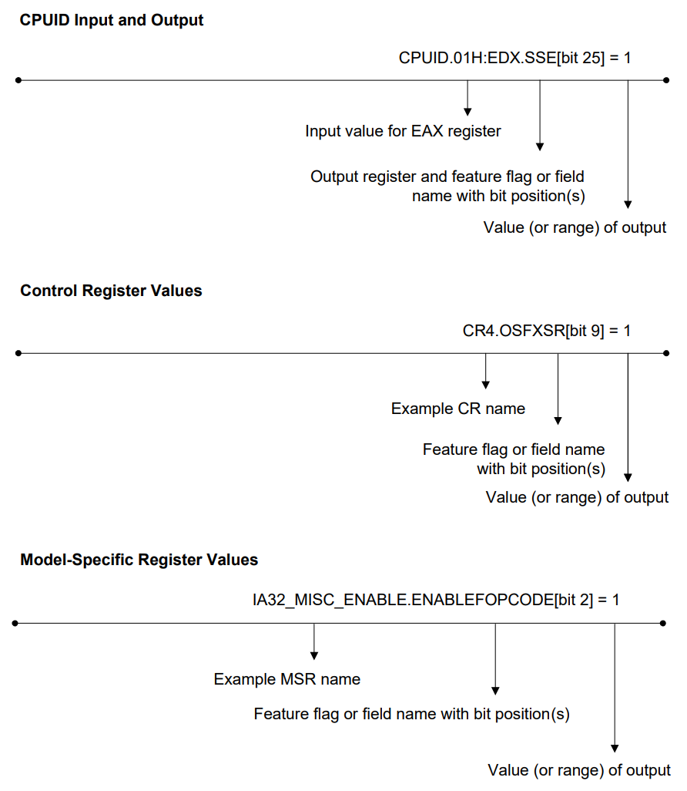

1. CPUID 指令用于获取处理器的标识和特性信息，它通过填充 EAX、EBX、ECX 和 EDX 寄存器来
   返回关于处理器家族、型号、功能和扩展信息
2. 控制寄存器（CR），如 CR0、CR3 和 CR4，用于控制处理器的操作模式和状态
3. MSR 寄存器用于获取和配置处理器的特定功能

异常
-----

异常通常是在指令导致错误时发生的事件。例如，尝试除以零就会产生一个异常。然而，有些异常，
如断点，是在其他条件下发生的。一些类型的异常可能会提供错误代码。错误代码报告了关于错误的
额外信息。下面展示了一个异常和错误代码： ::

    #PF(fault code)

这是一个某种错误代码（fault code）的页面异常（page-fault）。在某些条件下，异常可能无法
准确报告对应的错误代码，在这种情况下可能使用错误代码零，例如下面的通用保护异常： ::

    #GP(0)

执行环境
========

本章描述了 Intel 64 或 IA-32 处理器的基本执行环境，这是汇编语言程序员所看到的。它描述了
处理器如何执行指令以及如何存储和操作数据。这里描述的执行环境包括内存（地址空间）、通用数
据寄存器、段寄存器、标志寄存器和指令指针寄存器。

下面所列的是 Intel 已经移除的和将要移除的特性： ::

    特性                                                        移除年份
    Intel Memory Protection Extensions (Intel MPX)              2019
    MSR_TEST_CTRL, bit 31 (MSR address 33H)                     2019
    Hardware Lock Elision (HLE)                                 2019
    VP2INTERSECT                                                2023
    xAPIC mode                                                  2025
    Uncore PMI. IA32_DEBUGCTL MSR, bit 13 (MSR address 1D9H)    2026

操作模式
---------

IA-32 架构支持三种基本的操作模式：保护模式、实地址模式和系统管理模式。操作模式决定了可以
访问哪些指令和架构特性：

1. 保护模式（Protected mode） — 这是处理器的原生状态。保护模式的能力之一是能够直接在受
   保护的多任务环境中执行实地址模式 8086 软件。这个特性称为虚拟 8086 模式（virtual-8086
   mode），尽管它实际上并不是一个处理器模式。虚拟 8086 模式实际上是可以为任何任务启用的
   保护模式属性。

2. 实地址模式（Real-address mode） — 这种模式实现了 Intel 8086 处理器的编程环境，并带
   有扩展（例如，能够切换到保护模式或系统管理模式）。处理器在上电或复位后进入实地址模式。

3. 系统管理模式 (System management mode, SSM) — 这种模式为操作系统或执行体提供了一个
   透明机制，用于实现平台特定功能，如电源管理和系统安全。当外部 SMM 中断引脚（SMI#）被
   激活或从高级可编程中断控制器（APIC）接收到 SMI 时，处理器进入 SMM。

   在 SMM 中，处理器切换到一个单独的地址空间，同时保存当前运行程序或任务的基本上下文。然
   后可以透明地执行特定于 SMM 的代码。从 SMM 返回后，处理器恢复到系统管理中断之前的状态。
   SMM 随着 Intel386 SL 和 Intel486 SL 处理器的推出而引入，并随着 Pentium 处理器家族
   成为 IA-32 的标准特性。

Intel 64 架构增加了 IA-32e 模式。IA-32e 模式有两个子模式，分别是：

1. 兼容模式（IA-32e 的子模式） — 兼容模式允许大多数传统的 16 位和 32 位应用程序在 64
   位操作系统下无需重新编译即可运行。为简洁起见，在 IA-32 架构中，兼容子模式被称为兼容
   模式。兼容模式的执行环境与下一章节中描述的相同。兼容模式还支持 64 位和保护模式下支持
   的所有特权级别。在虚拟 8086 模式下运行或使用硬件任务管理的传统应用程序将无法在此模式
   下工作。

   操作系统（OS）可以基于一个代码段启用兼容模式。这意味着一个 64 位操作系统可以支持 64
   位应用程序在 64 位模式下运行，并且同时支持传统的 32 位应用程序（未重新编译为 64 位）
   在兼容模式下运行。

   兼容模式类似于 32 位保护模式。应用程序只能访问前 4 GB 的线性地址空间。兼容模式使用
   16 位和 32 位地址和操作数大小。像保护模式一样，这种模式允许应用程序通过 PAE（物理地
   址扩展）访问超过 4 GB 的物理内存。

2. 64 位模式（IA-32e 的子模式） — 这种模式使 64 位操作系统能够运行编写为访问 64 位线性
   地址空间的应用程序。为简洁起见，在 IA-32 架构中，64 位子模式被称为 64 位模式。

   64 位模式将通用寄存器和 SIMD 扩展寄存器的数量从 8 个扩展到 16 个。通用寄存器扩展到
   64 位。该模式还引入了一个新的操作码前缀（REX）以访问寄存器扩展。

   64 位模式由操作系统基于代码段启用。其默认地址大小为 64 位，其默认操作数大小为 32 位。
   可以在逐条指令上使用 REX 操作码前缀以及结合操作数大小前缀来修改默认的操作数大小。

   REX 前缀允许在 64 位模式下指定 64 位操作数。通过使用这种机制，许多现有指令可以得到提
   升，允许使用 64 位寄存器和 64 位地址。

环境概览
---------

在 IA-32 处理器上运行的任何程序或任务都被赋予了一组资源，用于执行指令以及存储代码、数据
和状态信息。这些资源构成了 IA-32 处理器的基本执行环境。

Intel 64 处理器支持 IA-32 处理器的基本执行环境，并在 IA-32e 模式下提供了一个类似的环
境，可以执行 64 位程序（64 位子模式）和 32 位程序（兼容子模式）。基本执行环境由运行在处
理器上的应用程序和操作系统或执行体共同使用。

* 地址空间 — 在 IA-32 处理器上运行的任何任务或程序都可以寻址高达 4 GB（2^32 字节）的线
  性地址空间和高达 64 GB（2^36 字节）的物理地址空间。有关寻址超过 4 GB 地址空间的更多
  信息，参见保护模式下的扩展物理寻址部分的内容。

* 基本程序执行寄存器 — 八个通用寄存器、六个段寄存器、EFLAGS 寄存器和 EIP（指令指针）寄
  存器构成了执行一组通用指令的基本执行环境。这些指令执行基本的整数算术运算（字节、字和双
  字整数）、处理程序流程控制、操作位和字节流以及寻址内存。有关这些寄存器的更多信息，参见
  基本程序执行寄存器部分的内容。

* x87 FPU 寄存器 — 八个 x87 FPU 数据寄存器、x87 FPU 控制寄存器、状态寄存器、x87 FPU
  指令指针寄存器、x87 FPU 操作数（数据）指针寄存器、x87 FPU 标记寄存器和 x87 FPU 操作
  码寄存器提供了一个执行环境，用于操作单精度、双精度和双扩展精度浮点值、字整数、双字整数、
  四字整数和二进制编码的十进制（BCD）值。有关这些寄存器的更多信息，参见 x87 FPU 执行环
  境部分的内容。

* MMX 寄存器 — 八个 MMX 寄存器支持在 64 位打包的字节、字和双字整数上执行单指令多数据
  （SIMD）操作。有关这些寄存器的更多信息，参见 MMX 技术编程环境部分的内容。

* XMM 寄存器 — 八个 XMM 数据寄存器和 MXCSR 寄存器支持在 128 位打包的单精度和双精度浮点
  值以及 128 位打包的字节、字、双字和四字整数上执行 SIMD 操作。有关这些寄存器的更多信息，
  参见 Intel SSE 编程环境部分的内容。

* YMM 寄存器 — YMM 数据寄存器支持在 256 位打包的单精度和双精度浮点值以及 256 位打包的
  字节、字、双字和四字整数上执行 256 位 SIMD 操作。

* 边界寄存器 — 每个 BND0-BND3 寄存器存储与内存缓冲区指针相关联的下限和上限（各 64 位）。
  它们支持执行 Intel MPX 指令。

* BNDCFGU 和 BNDSTATUS — BNDCFGU 配置用户模式 MPX 操作的边界检查。BNDSTATUS 提供了由
  MPX 操作引起的 #BR 的额外信息。

* 程序栈 — 为了支持过程或子程序调用以及在过程或子程序之间传递参数，执行环境包括了栈和栈
  管理资源。栈位于内存中，有关栈结构的更多信息，请参见过程调用中的栈部分。

除了基本执行环境中提供的资源外，IA-32 架构还将以下资源作为其系统级架构的一部分提供。它
们为操作系统和系统开发软件提供了扩展支持。除了 I/O 端口外，系统资源在第三卷中有详细描述。

* I/O 端口 — IA-32 架构支持数据传输到输入/输出（I/O）端口。参见本卷输入/输出部分。

* 控制寄存器 — 五个控制寄存器（CR0 到 CR4）决定了处理器的操作模式和当前执行任务的特征。
  参见第三卷中系统架构概览部分。

* 内存管理寄存器 — GDTR、IDTR、任务寄存器和 LDTR 指定了在保护模式内存管理中使用的数据
  结构的位置。参见第三卷中系统架构概览部分。

* 调试寄存器 — 调试寄存器（DR0 到 DR7）控制和监控处理器的调试操作。参见第三卷。

* 内存类型范围寄存器 (MTRRs) — MTRRs 用于给内存区域配置内存类型。参见第三卷中关于 MTRRs
  的部分。

* MSR 寄存器 — 处理器提供了各种 MSR 寄存器，用于控制和报告处理器性能。几乎所有 MSRs 都
  处理系统相关功能，并且对应用程序不可访问。一个例外是时间戳计数器。MSRs 描述在第四卷。

* 机器检查寄存器 — 机器检查寄存器由一组控制、状态和错误报告 MSR 寄存器组成，用于检测和
  报告硬件（机器）错误。参见第三卷机器检查架构部分。

* 性能监控计数器 — 性能监控计数器允许监控处理器性能事件。参见第三卷性能监控部分。

以上介绍的32位执行环境资源如下图：

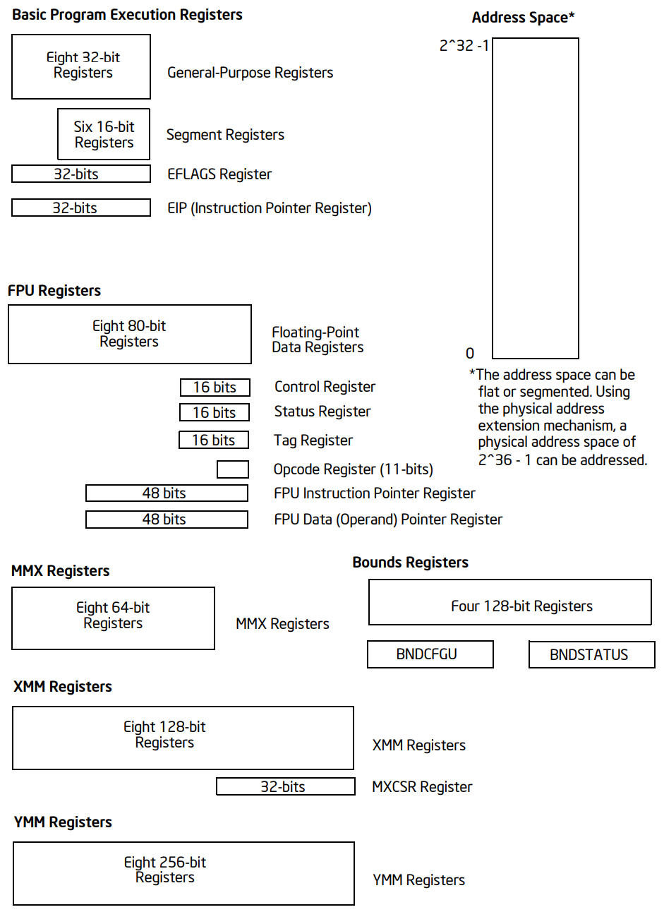

**64位执行环境**

在 64 位模式下，执行环境与上述描述的类似，其中不同的部分描述如下：

* 地址空间 — 在 IA-32 处理器上以 64 位模式运行的任务或程序可以寻址高达 2^64 字节的线性
  地址空间和高达 2^52 字节的物理地址空间。软件可以通过 CPUID 查询处理器支持的物理地址大
  小。

* 基本程序执行寄存器 — 可用的通用寄存器（GPRs）数量为 16 个。GPRs 为 64 位宽，支持对字
  节、字、双字和四字整数的操作。访问字节寄存器统一到最低的 8 位。指令指针寄存器变为 64
  位。EFLAGS 寄存器扩展到 64 位宽，并被称为 RFLAGS 寄存器。RFLAGS 的上 32 位保留，下
  32 位与 EFLAGS 相同。

* XMM 寄存器 — 有 16 个 XMM 数据寄存器用于 SIMD 操作。有关这些寄存器的更多信息，参见
  Intel SSE 编程环境部分。

* YMM 寄存器 — 有 16 个 YMM 数据寄存器用于 SIMD 操作。有关这些寄存器的更多信息，参见使
  用 Intel AVX, FMA 和 Intel AVX2 编程部分。

* 边界寄存器（BND）、BNDCFGU、BNDSTATUS — 参阅使用 XSAVE 管理状态和附录 E。

* 程序栈 — 栈指针大小为 64 位。栈大小不再由 SS 描述符中的位控制（与非 64 位模式不同），
  也不能通过指令前缀覆盖指针大小。

* 控制寄存器 — 控制寄存器扩展到 64 位。新增了一个控制寄存器（任务优先寄存器：CR8 或 TPR）。

* 调试寄存器 — 调试寄存器扩展到 64 位。参见第三卷调试、分支分析、TSC 和 Intel 资源导向
  技术部分。

* 描述符表寄存器 — 全局描述符表寄存器（GDTR）和中断描述符表寄存器（IDTR）扩展到 10 字
  节，以便它们可以包含完整的 64 位基地址。本地描述符表寄存器（LDTR）和任务寄存器（TR）
  也扩展以包含完整的 64 位基地址。

以上介绍的64位执行环境资源如下图：

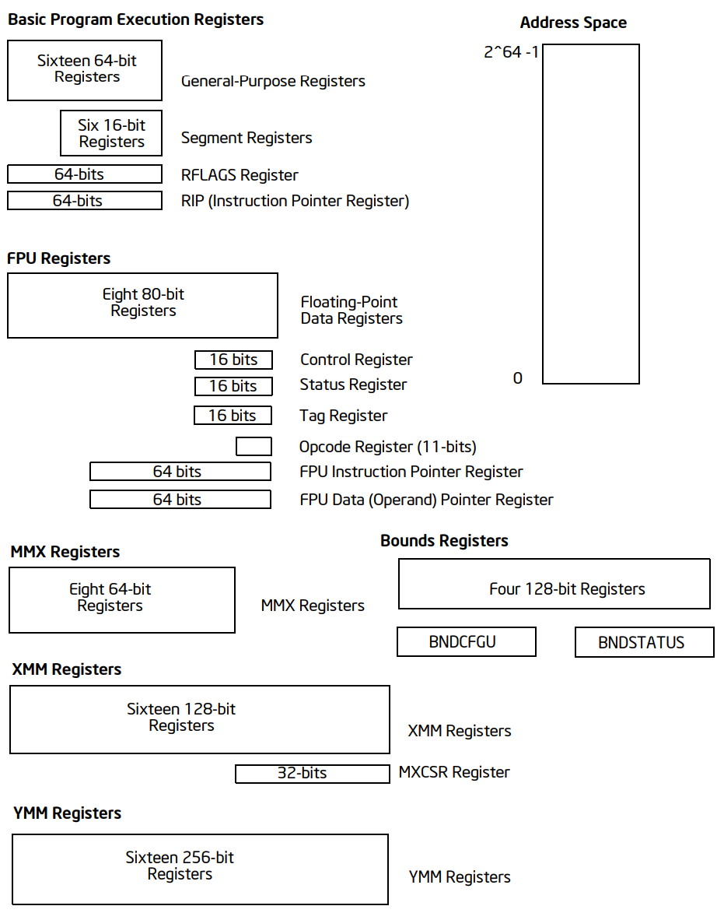

内存组织
---------

处理器在其总线上寻址的内存称为物理内存。物理内存被组织为一系列 8 位字节。每个字节都被分
配一个唯一的地址，称为物理地址。如果处理器不支持 Intel 64 架构，物理地址空间的范围从零
到最大 2^36 - 1（64 GB）。Intel 64 架构引入了物理和线性地址空间的一系列变化，这些变化
在后文中描述。

几乎所有设计用于与 IA-32 或 Intel 64 处理器一起工作的操作系统或执行体都会使用处理器的内
存管理设施来访问内存。这些设施提供了诸如分段和分页等功能，允许高效且可靠地管理内存。内存
管理在第三卷保护模式内存管理部分有详细描述。以下段落描述使用内存管理时寻址内存的基本方法。

**IA-32 内存模型**

在使用处理器的内存管理功能时，程序不会直接寻址物理内存。相反，它们使用三种内存模型之一来
访问内存：平坦（flat）、分段（segmented）或实地址模式（real address mode）：

* 平坦内存模型 — 内存对程序来说是一个单一的、连续的地址空间。这个空间称为线性地址空间。
  代码、数据和栈都包含在这个地址空间中。线性地址空间是按字节寻址的，地址从 0 到 2^32-1
  （如果不是在 64 位模式下）。线性地址空间中任何字节的地址称为线性地址。

* 分段内存模型 — 内存对程序来说是一个由多个独立地址空间组成的组，称为段。代码、数据和栈
  通常包含在不同的段中。要寻址段中的一个字节，程序操作一个逻辑地址。这包括一个段选择器和
  一个偏移量（逻辑地址通常被称为远指针）。段选择器标识要访问的段，偏移量标识段地址空间中
  的一个字节。在 IA-32 处理器上运行的程序可以寻址多达 16,383 个不同大小和类型的段，每个
  段可以有 2^32 字节。

  在内部，为系统定义的所有段都被映射到处理器的线性地址空间中。因此，要访问内存位置，处理
  器将每个逻辑地址转换为线性地址，这种转换对应用程序是透明的。使用分段内存的主要原因是提
  高程序和系统的可靠性。例如，将程序的栈放置在单独的段中可以防止栈扩展到代码或数据空间，
  并覆盖相应的指令或数据。

* 实地址模式内存模型 — 这是 Intel 8086 处理器的内存模型。它被支持只是为了与现存的只被编
  写用于 Intel 8086 处理器运行的程序兼容。实地址模式使用一种特定的分段内存实现，其中程
  序和操作系统或执行体的线性地址空间由最多 64 KBytes 大小的段数组组成。实地址模式中线性
  地址空间的最大大小是 2^20 字节。更多信息，请参见第三卷 8086 仿真部分。

三种内存管理模型如下图：

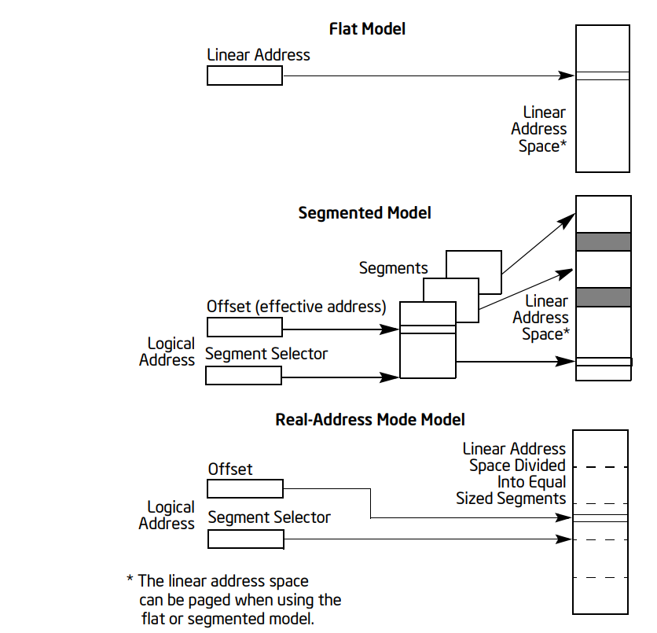

**分页和虚拟内存**

在使用平坦或分段内存模型时，线性地址空间要么直接映射到处理器的物理地址空间，要么通过分页
映射。当使用直接映射（分页禁用）时，每个线性地址与一个物理地址有一一对应的关系。线性地址
在处理器的地址线上发送时无需转换。

当使用 IA-32 架构的分页机制（分页启用）时，线性地址空间被划分为多个页面，这些页面映射到
虚拟内存。然后根据需要将虚拟内存的页面映射到物理内存中。当操作系统或执行体使用分页时，分
页机制对应用程序是透明的。应用程序所看到的只是线性地址空间。

此外，IA-32 架构的分页机制包括支持以下扩展：

* 物理地址扩展 (PAE)：用于寻址超过 4 GB 的物理地址空间。
* 页面大小扩展 (PSE)：将线性地址映射到 4 MB 的物理地址页面。

更多信息，参见第三卷保护模式内存管理部分。

**操作模式和内存模型**

当为 IA-32 或 Intel 64 处理器编写代码时，程序员需要知道处理器在执行代码时将处于哪种操作
模式以及正在使用的内存模型。操作模式和内存模型之间的关系如下：

* 保护模式 — 在保护模式下，处理器可以使用本节描述的任何内存模型（但通常，仅当处理器处于
  虚拟-8086 模式时才使用实地址模式内存模型）。使用的内存模型取决于操作系统或执行体的设
  计。当实现多任务处理时，各个任务可以使用不同的内存模型。

* 实地址模式 — 当处于实地址模式时，处理器仅支持实地址模式内存模型。

* 系统管理模式 — 当处于 SMM 时，处理器切换到一个单独的地址空间，称为系统管理 RAM（SMRAM）。
  用于在此地址空间中寻址字节的内存模型类似于实地址模式模型。有关在 SMM 中使用的内存模型
  的更多信息，参见第三卷系统管理模式。

* 兼容模式 — 需要在兼容模式下运行的软件遵守的内存模型与 32 位保护模式下相同。分段的效果
  与 32 位保护模式语义中的相同。

* 64 位模式 — 通常（但不是完全）禁用了分段，从而创建了一个平坦的 64 位线性地址空间。具
  体来说，处理器在 64 位模式下将 CS、DS、ES 和 SS 的段基址视为零（这使得线性地址等于有
  效地址）。分段和实地址模式在 64 位模式下不可用。

**32/16位地址和操作数大小**

在保护模式下，IA-32 处理器可以配置为 32 位或 16 位地址和操作数大小。使用 32 位地址和操
作数大小时，最大的线性地址或段偏移量是 FFFFFFFFH（2^32 − 1）；操作数大小通常是 8 位或
32 位。使用 16 位地址和操作数大小时，最大的线性地址或段偏移量是 FFFFH（2^16 − 1）；操
作数大小通常是 8 位或 16 位。

当使用 32 位寻址时，逻辑地址（或远指针）由 16 位段选择器和 32 位偏移量组成；当使用 16
位寻址时，地址由 16 位段选择器和 16 位偏移量组成。指令前缀允许在程序内临时覆盖默认的地址
或操作数大小。

在保护模式下运行时，当前执行的代码段的段描述符定义了默认的地址和操作数大小。段描述符是一
个系统数据结构，通常对应用程序代码不可见。汇编命令允许为程序选择默认的寻址和操作数大小，
汇编器和其他工具随后为代码段设置适当的段描述符。

在实地址模式下运行时，默认的寻址和操作数大小是 16 位。在实地址模式中可以使用地址大小覆盖
来启用 32 位寻址。然而，允许的最大 32 位线性地址仍然是 000FFFFFH（2^20 − 1）。

**保护模式下的扩展物理寻址**

从 P6 系列处理器开始，IA-32 架构支持寻址高达 64 GB（2^36 字节）的物理内存。程序或任务
不能直接在该地址空间中的地址寻址。相反，它通过虚拟内存管理机制寻址最大为 4 GB 的各个线性
地址空间，这些空间映射到 64 GB 的物理地址空间。使用这种机制，操作系统可以使程序在 64 GB
物理地址空间内切换 4 GB 线性地址空间。

使用扩展物理寻址要求处理器在保护模式下运行，并且要求操作系统提供虚拟内存管理系统。更多信
息，见第三卷使用 PAE 分页机制的 36 位物理寻址。

**64 位模式内存组织**

Intel 64 架构支持超过 64 GB 的物理地址空间。在 64 位模式下，架构支持 64 位的线性地址空
间。然而，支持 Intel 64 架构的处理器可能实现的位数少于 64 位。

在 64 位模式下，代码、数据和栈通常使用平坦的地址空间。在 64 位模式下（如果没有覆盖地址大
小），有效地址计算的大小是 64 位。一个有效地址计算使用 64 位基址和索引寄存器，并将符号位
扩展到 64 位。

在 64 位模式的平坦地址空间中，线性地址等于有效地址，因为基址为零。如果使用非零基址的 FS
或 GS 段，则此规则不适用。在 64 位模式下，有效地址在加上完整的 64 位段基址之前被截断（例
如 LEA 指令）。无论 64 位模式中的寻址方式如何，基址永远不会被截断。

指令指针扩展到 64 位以支持 64 位代码偏移量。64 位指令指针称为 RIP。下表展示了 RIP、EIP
和 IP 之间的关系。 ::

                    比特63~32   比特31~16   比特15~0
    16位指令指针            不被修改         IP
    32位指令指针     零扩展      EIP
    64位指令指针     RIP

通常，在 64 位模式下，移位和立即数不会扩展到 64 位。它们仍然限制为 32 位，并在有效地址
计算期间进行符号扩展。然而，在 64 位模式下，为 MOV 指令提供了 64 位偏移和立即数的支持。

所有 16 位和 32 位地址计算在 IA-32e 模式下进行零扩展形成 64 位地址。地址计算首先被截断
到当前模式（64 位模式或兼容模式）的有效地址大小，如任何地址大小前缀限制的大小。然后，结果
被零扩展到完整的 64 位地址宽度。

由于这个原因，16 位和 32 位应用程序在兼容模式下运行时只能访问 64 位模式有效地址的低 4GB。
同样，在 64 位模式下生成的 32 位地址也只能访问 64 位模式有效地址的低 4GB。

**规范寻址**

在 64 位模式下，如果地址位 63 到微架构实现的最高有效位被设置为全 1 或全 0，则认为地址处
于规范形式。Intel 64 架构定义了一个 64 位线性地址，但实现可能支持较少位数。首个支持 Intel 64
架构的 IA-32 处理器实现支持 48 位线性地址。这意味着规范地址必须将位 63 到 48 位设置为零
或一（取决于第 47 位是零还是一）。

尽管实现可能不使用线性地址的所有 64 位，但它们应该检查位 63 到最高有效实现位以查看地址是
否处于规范形式。如果线性内存引用不处于规范形式，实现应该生成一个异常。在大多数情况下，会
生成一个通用保护异常（#GP）。然而，在显式或隐式栈引用的情况下，会生成一个栈故障（#SS）。

默认情况下，具有隐式栈引用的指令使用 SS 段寄存器，这些包括 PUSH/POP 相关指令和使用 RSP/RBP
作为基址寄存器的指令。在这些情况下，规范故障是 #SS。

如果指令使用基址寄存器 RSP/RBP 并使用段覆盖前缀指定非 SS 段，则规范故障产生 #GP（而不是
#SS）。在 64 位模式下，只有 FS 和 GS 段覆盖在此情况下适用。其他段覆盖前缀（CS、DS、ES
和 SS）被忽略。请注意，这也意味着非栈寄存器引用如果指定 SS 段将会被忽略。这样的序列仍然
会产生 #GP 规范故障（而不是 #SS）。

基本寄存器
----------

IA-32 架构提供了 16 个基本程序执行寄存器，用于通用系统和应用程序。这些寄存器可以分为以
下几组：

* 通用寄存器：这八个寄存器可用于存储操作数和指针
* 段寄存器：这六个寄存器用于段选择
* EFLAGS 寄存器（程序状态和控制）：EFLAGS 寄存器报告正在执行的程序的状态，并允许有限的
  （应用程序级别）对处理器的控制
* EIP 寄存器（指令指针）：EIP 寄存器是一个 32 位指针指向下一条要执行的指令 

**通用寄存器**

32 位通用寄存器 EAX、EBX、ECX、EDX、ESI、EDI、EBP 和 ESP 用于保存以下内容：

* 逻辑和算术操作的操作数
* 地址计算的操作数
* 内存指针

尽管所有这些寄存器都可用于操作数、结果和指针的通用存储，但在涉及 ESP 寄存器时应谨慎。ESP
寄存器保存栈指针，通常不应该用于其他目的。许多指令指定特定的寄存器来保存操作数。例如，字
符串指令使用 ECX、ESI 和 EDI 寄存器的内容作为操作数。当使用分段内存模型时，一些指令假设
某些寄存器中的指针是相对于特定段的。例如，一些指令假设 EBX 寄存器中的指针指向 DS 段中的
内存位置。

在本卷指令集摘要中描述了指令对通用寄存器的特殊用途，更多信息见本卷的后续章节。以下是特殊
用途汇总：

* EAX — 累加器用于操作数和结果数据
* EBX — 指针指向 DS 段中的数据
* ECX — 字符串和循环操作的计数器
* EDX — I/O 指针
* ESI — 指向 DS 寄存器指向的段中数据的指针，字符串操作的源指针
* EDI — 指向 ES 寄存器指向的段中数据的指针，字符串操作的目标指针
* ESP — 栈顶指针（位于 SS 段）
* EBP — 指向栈中数据（位于 SS 段）

通用寄存器的低 16 位直接映射到 8086 和 Intel 286 处理器中的寄存器集，并且可以使用名称
AX、BX、CX、DX、BP、SI、DI 和 SP 引用。EAX、EBX、ECX 和 EDX 寄存器的低两个字节可以通
过名称 AH、BH、CH 和 DH（高字节）以及 AL、BL、CL 和 DL（低字节）引用。

**64位模式的通用寄存器**

在 64 位模式下，有 16 个通用寄存器，并且默认操作数大小是 32 位。然而，通用寄存器能够处
理 32 位或 64 位操作数。如果指定了 32 位操作数大小：EAX、EBX、ECX、EDX、EDI、ESI、EBP、
ESP、R8D ~ R15D 都是可用的。如果指定了 64 位操作数大小：RAX、RBX、RCX、RDX、RDI、RSI、
RBP、RSP、R8 ~ R15 都是可用的。R8D ~ R15D 和 R8 ~ R15 表示八个新的通用寄存器。

所有这些寄存器都可以在字节、字、双字和四字级别上被访问。使用 REX 前缀来生成 64 位操作数
大小或引用寄存器 R8 ~ R15。 ::

    寄存器类型  不用REX                          使用REX
    字节寄存器  AL BL CL DL AH BH CH DH          AL BL CL DL DIL SIL BPL SPL R8B ~ R15B
    字长寄存器  AX BX CX DX DI SI BP SP          AX BX CX DX DI SI BP SP R8W ~ R15W
    双字寄存器  EAX EBX ECX EDX EDI ESI EBP ESP  EAX EBX ECX EDX EDI ESI EBP ESP R8D ~ R15D
    四字寄存器  无                               RAX RBX RCX RDX RDI RSI RBP RSP R8 ~ R15

仅在 64 位模式下可用的寄存器（R8 ~ R15 和 XMM8 ~ XMM15）在从 64 位模式切换到兼容模式
然后返回到 64 位模式时会被保护。然而，从 64 位模式通过兼容模式到传统或实模式然后通过兼容
模式返回到 64 位模式后，R8 ~ R15 和 XMM8 ~ XMM15 的值是未定义的。

在 64 位模式下，对字节寄存器的访问有限制。指令不能同时引用传统的高字节（例如 AH、BH、CH、
DH）和一个新的字节寄存器（例如 RAX 寄存器的低字节）。然而，指令可以同时引用传统的低字节
（例如 AL、BL、CL 或 DL）和新的字节寄存器（例如 R8 寄存器的低字节或 RBP）。架构通过更改
使用 REX 前缀的指令中的高字节引用（AH、BH、CH、DH）为低字节引用（BPL、SPL、DIL、SIL）
来强制执行此限制。

当处于 64 位模式时，操作数大小决定了目标通用寄存器中有效位数的数量：

* 64 位操作数在目标通用寄存器中生成一个 64 位结果
* 32 位操作数在目标通用寄存器中生成一个 32 位结果，零扩展到 64 位结果
* 8 位和 16 位操作数生成一个 8 位或 16 位结果，目标通用寄存器的上 56 位或 48 位（分别）
  不会被操作修改，如果 8 位或 16 位操作的结果用于 64 位地址计算，明确地将寄存器符号扩展
  到完整的 64 位

由于在 32 位模式下 64 位通用寄存器的上 32 位是未定义的，因此在从 64 位模式切换到 32 位
模式（到保护模式或兼容模式）时，任何通用寄存器的上 32 位不会被保留。软件不应依赖这些位在
64 位到 32 位模式切换后保持值。

**段寄存器**

段寄存器（CS、DS、SS、ES、FS 和 GS）保存 16 位的段选择器。段选择器是一种特殊的指针，用
于标识内存中的一个段。要访问内存中的特定段，必须在相应的段寄存器中放置该段的段选择器。编
写应用程序代码时，程序员通常使用汇编命令和符号来创建段选择器。然后，汇编器和其他工具会创
建与这些指令和符号相关联的实际段选择器值。如果编写系统代码，程序员可能需要直接创建段选择
器。更多信息，参见第三卷保护模式内存管理。

段寄存器的使用方式取决于操作系统或执行体使用的内存管理模型类型。当使用平坦（未分段）内存
模型时，段寄存器被加载的段选择器指向重叠的分段，每个重叠段都从线性地址空间的地址 0 开始。
这些重叠的段组成了程序的线性地址空间。通常定义两个重叠的段：一个用于代码，另一个用于数据
和栈。CS 段寄存器指向代码段，所有其他段寄存器指向数据和栈段。以下是平坦内存模型下的段寄
存器的使用：

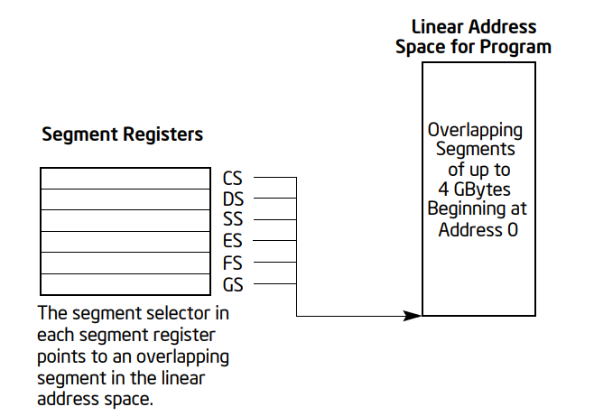

当使用分段内存模型时，通常每个段寄存器都加载有不同的段选择器，以便每个段寄存器指向线性地
址空间中的不同段。因此在任何时间，程序都可以访问线性地址空间中的六个段。要访问段寄存器未
指向的段，程序必须先将要访问的段的段选择器加载到段寄存器中。以下是分段内存模型下的段寄存
器的使用：

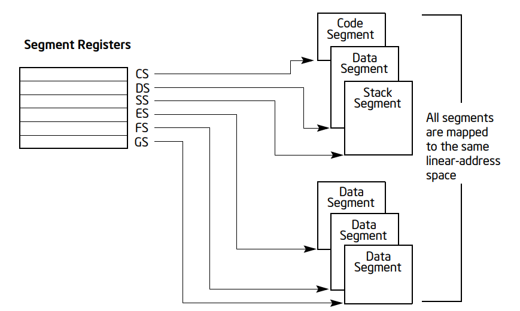

每个段寄存器都与三种存储类型之一相关：代码、数据或栈。例如，CS 寄存器包含代码段的段选择
器，其中存储了正在执行的指令。处理器使用 CS 寄存器中的段选择器和 EIP 寄存器的内容组成的
逻辑地址从代码段中获取指令。EIP 寄存器包含要执行的下一条指令在代码段内的偏移量。CS 寄存
器不能被应用程序显式加载。相反，它是由改变程序控制的指令或内部处理器操作隐式加载的（例如
过程调用、中断处理或任务切换）。

DS、ES、FS 和 GS 寄存器指向四个数据段。四个数据段的可用性允许高效且安全地访问不同类型的
数据结构。例如，可以创建四个单独的数据段：一个用于当前模块的数据结构，另一个用于从更高级
模块导出的数据，第三个用于动态创建的数据结构，第四个用于与其他程序共享的数据。要访问其他
数据段，应用程序必须根据需要将这些段的段选择器加载到 DS、ES、FS 和 GS 寄存器中。

SS 寄存器包含栈段的段选择器，其中存储了当前正在执行的程序、任务或处理程序的过程栈。所有
栈操作都使用 SS 寄存器来查找栈段。与 CS 寄存器不同，SS 寄存器可以显式加载，这允许应用程
序设置多个栈并在它们之间切换。

四个段寄存器 CS、DS、SS、ES 与 Intel 8086 和 Intel 286 处理器中的段寄存器相同，FS 和
GS 寄存器是随着 Intel386 系列处理器引入 IA-32 架构的。

**64位模式的段寄存器**

在 64 位模式下，CS（代码段）、DS（数据段）、ES（附加段）、SS（堆栈段）被视为每个段基址
为 0，不管相关段描述符基址的值如何。这为代码、数据和栈创建了一个平坦的地址空间。FS 和
GS 寄存器是例外。这两个段寄存器可以用作线性地址计算中的额外基址寄存器（对本地数据和某些
操作系统数据结构的寻址）。

尽管通常禁用了分段，但加载段寄存器可能还是会导致处理器执行段访问的辅助操作。在这些活动中，
启用的处理器仍将对加载的值执行大多数传统检查（即使这些检查在 64 位模式下不适用）。这样的
检查是必要的，因为在 64 位模式下加载的段寄存器可能被在兼容模式下运行的应用程序使用。

在 64 位模式下，CS、DS、ES、SS、FS 和 GS 的极限检查被禁用。这意味着处理器不会对这些段寄
存器的值进行限制范围检查，这些检查在传统的实模式或保护模式中用于确保段内偏移量不会超出段
的界限。

**EFLAGS寄存器**

32 位 EFLAGS 寄存器包含一组状态标志、一个控制标志和一组系统标志。在处理器初始化后（通过
断言 RESET 引脚或 INIT 引脚），EFLAGS 寄存器的状态为 00000002H。此寄存器的位 1、3、5、
15 以及 22 至 31 位是保留的。软件不应使用或依赖这些位的状态。在 64 位模式下，EFLAGS 寄
存器被扩展到 64 位，并被称为 RFLAGS。RFLAGS 寄存器的上 32 位是保留的。RFLAGS 的下 32
位与 EFLAGS 相同。

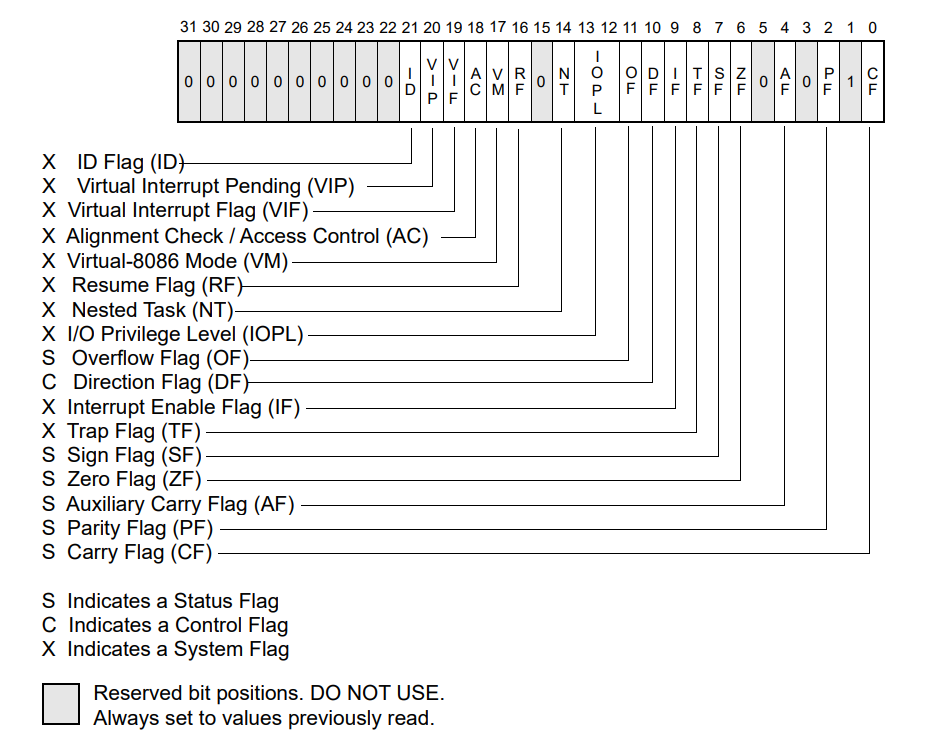

EFLAGS 寄存器中的一些标志可以直接修改，使用特殊指令（在以下部分中描述）。没有指令允许直
接检查或修改整个寄存器。以下指令可用于将标志组移动到过程栈或 EAX 寄存器：LAHF、SAHF、
PUSHF、PUSHFD、POPF、POPFD。将 EFLAGS 寄存器的内容传输到过程栈或 EAX 寄存器后，可以使
用处理器的位操作指令（BT、BTS、BTR 和 BTC）检查和修改标志。

当挂起任务（使用处理器的多任务设施）时，处理器会自动将 EFLAGS 寄存器的状态保存在被挂起
任务的任务状态段（TSS）中。当绑定到新任务时，处理器会从新任务的 TSS 中加载 EFLAGS 寄存
器的数据。

当调用中断或异常处理程序时，处理器会自动将 EFLAGS 寄存器的状态保存在过程栈上。当使用任务
切换处理中断或异常时，EFLAGS 寄存器的状态保存在被挂起任务的 TSS 中。

随着 IA-32 架构的发展，EFLAGS 寄存器中增加了标志，但现有标志的功能和位置从一代 IA-32
处理器到下一代保持不变。因此，对于一代 IA-32 处理器访问或修改这些标志的代码在运行在后续
处理器上时，会按预期工作。

EFLAGS 寄存器的一个控制标志，方向标志（DF）控制字符串指令（MOVS、CMPS、SCAS、LODS 和
STOS）。设置 DF 标志会导致字符串指令自动递减（从高地址向低地址处理字符串）。清除 DF 标
志会导致字符串指令自动递增（从低地址向高地址处理字符串）。STD（设置方向标志）和 CLD（清
除方向标志）指令分别用于设置和清除 DF 标志。

EFLAGS 寄存器的状态标志（位 0、2、4、6、7 和 11）指示算术指令的结果，例如 ADD、SUB、MUL
和 DIV 指令。状态标志的功能如下：

CF（进位标志，位 0）
    如果算术运算在结果的最高位产生进位或借位，则设置此标志；否则清除。此标志表示无符号整
    数算术的溢出条件。它也用于多精度算术。
PF（奇偶标志，位 2）
    如果结果的最低字节中 1 的数量为偶数，则设置此标志；否则清除。
AF（辅助进位标志，位 4）
    如果算术运算在结果的第 3 位产生进位或借位，则设置此标志；否则清除。此标志用于二进制
    编码的十进制（BCD）算术。
ZF（零标志，位 6）
    如果结果为零，则设置此标志；否则清除。
SF（符号标志，位 7）
    设置为结果的最高位，即有符号整数的符号位（0 表示正值，1 表示负值）
OF（溢出标志，位 11）
    如果整数结果太大（正数）或太小（负数）（不包括符号位）而无法适应目标操作数，则设置此
    标志；否则清除。此标志指示有符号整数（二进制补码）算术的溢出条件。

在这些状态标志中，只有 CF 标志可以直接修改，使用 STC（设置进位标志）、CLC（清除进位标志）
和 CMC（补充进位标志）指令。另外，位指令（BT、BTS、BTR 和 BTC）将指定的位复制到 CF 标
志中。

状态标志允许单个算术运算为三种不同的数据类型产生结果：无符号整数、有符号整数和 BCD 整数。
如果将算术运算的结果视为无符号整数，CF 标志指示范围超出条件（进位或借位）；如果视为有符
号整数（二进制补码数），OF 标志指示进位或借位；如果视为 BCD 数字，AF 标志指示进位或借位。
SF 标志指示有符号整数的符号。ZF 标志指示有符号或无符号整数的零。

在对整数进行多精度算术时，CF 标志与带进位加法（ADC）和带借位减法（SBB）指令一起使用，以
将一个计算的进位或借位传播到下一个计算。

条件指令 Jcc（根据条件码跳转）、SETcc（根据条件码设置字节）、LOOPcc 和 CMOVcc（条件移
动）使用一个或多个状态标志作为条件码，并测试它们以进行分支、设置字节或结束循环的条件。

EFLAGS 寄存器中的系统标志和 IOPL 字段控制操作系统或执行体操作。这些标志不应被应用程序修
改。系统标志的功能如下：

TF（陷阱标志，位 8）
    设置以启用调试的单步模式；清除以禁用单步模式。
IF（中断使能标志，位 9）
    控制处理器对可屏蔽中断请求的响应。设置以响应可屏蔽中断；清除以禁止可屏蔽中断。
IOPL（I/O 特权级别字段，位 12 和 13）
    指示当前运行程序或任务的 I/O 特权级。当前运行程序或任务的当前特权级别（CPL）必须小
    于或等于 I/O 特权级别才能访问 I/O 地址空间。POPF 和 IRET 指令只能在 CPL 为 0 时修
    改此字段。
NT（嵌套任务标志，位 14）
    控制中断和调用任务的调用链。当前任务被链接到先前执行的任务时设置；当前任务未链接到另
    一个任务时清除。
RF（恢复标志，位 16）
    控制处理器对调试异常的响应。
VM（虚拟 8086 模式标志，位 17）
    设置以启用虚拟 8086 模式；清除以返回到没有虚拟 8086 模式语义的保护模式。
AC（对齐检查（或访问控制）标志，位 18）
    如果 CR0 寄存器中的 AM 位设置，则当且仅当此标志为 1 时，启用用户模式数据访问的对齐
    检查。如果 CR4 寄存器中的 SMAP 位设置，则当且仅当此标志为 1 时，允许对用户模式页面
    的显式管理模式数据访问。有关详细信息，参阅第三卷访问权限部分。
VIF（虚拟中断标志，位 19）
    IF 标志的虚拟映像。与 VIP 标志结合使用（要使用此标志和 VIP 标志，需要通过在控制寄
    存器 CR4 中设置 VME 标志来启用虚拟模式扩展）
VIP（虚拟中断待处理标志，位 20）
    设置表示有中断待处理；当没有中断待处理时清除（软件设置清除此标志，处理器仅进行读取）。
    与 VIF 标志结合使用。
ID（标识标志，位 21）
    程序设置或清除此标志表明是否支持 CPUID 指令。

有关这些标志的详细描述，参见第三卷保护模式内存管理部分。

**指令指针**

指令指针（EIP）寄存器包含当前代码段中下一条要执行的指令的偏移量。在直线代码中，它从一个
指令推进到下一个，或者在执行 JMP、Jcc、CALL、RET 和 IRET 指令时向前或向后移动多个指令。

EIP 寄存器不能被软件直接访问；它被控制转移指令（如 JMP、Jcc、CALL 和 RET）、中断和异常
隐式控制。读取 EIP 寄存器的唯一方法是执行一个 CALL 指令，然后从过程栈读取返回指令指针的
值。EIP 寄存器可以通过修改过程栈上的返回指令指针的值并执行返回指令（RET 或 IRET）来间接
加载。有关详细信息，见后文返回指令指针部分。

所有 IA-32 处理器都预取指令。由于指令预取，从总线上读取的指令地址在指令加载期间与 EIP
寄存器中的值不匹配。尽管不同的处理器系列使用不同的预取机制，但 EIP 寄存器指导程序流程的
功能与所有为在 IA-32 处理器上运行而编写的软件完全兼容。

在 64 位模式下，RIP 寄存器成为指令指针。此寄存器保存下一条要执行的指令的 64 位偏移量。
64 位模式还支持一种称为 RIP 相对寻址的技术。使用这种技术，有效地址通过将偏移添加到下一
条指令的 RIP 来确定。

操作数大小
-----------

当处理器在保护模式下执行时，每个代码段都有一个默认的操作数大小属性和地址大小属性。这些属
性是通过代码段的段描述符中的 D（默认大小）标志选择的（见第三卷保护模式内存管理）。当设置
D 标志时，选择 32 位的操作数大小和地址大小属性；当清除该标志时，选择 16 位大小属性。当
处理器在实地址模式、虚拟 8086 模式或系统管理模式（SMM）下执行时，默认的操作数大小和地址
大小属性始终是 16 位。

操作数大小属性选择操作数的大小。当 16 位操作数大小属性生效时，操作数通常可以是 8 位或
16 位；当 32 位操作数大小属性生效时，操作数通常可以是 8 位或 32 位。地址大小属性选择用
于寻址内存的地址大小：16 位或 32 位。当 16 位地址大小属性生效时，段偏移量和位移是 16
位。这种限制将段的大小限制在 64 KB。当 32 位地址大小属性生效时，段偏移量和位移是
32 位，允许寻址高达 4 GB。

可以通过向指令添加操作数大小或地址大小前缀，覆盖特定指令的默认操作数大小或地址大小属性。
有关详细信息，请参阅后文的指令格式部分。这种前缀的效果仅适用于特定指令。

以下展示了在保护模式或兼容模式下执行时的有效操作数大小和地址大小（取决于 D 标志和操作数
大小和地址大小前缀的设置）。 ::

    代码段描述符中的 D 标志     0   0   0   0   1   1   1   1
    操作数大小前缀 66H         无  无  有   有  无  无  有  有
    地址大小前缀 67H           无  有  无   有  无  有  无  有
    有效操作数大小             16  16  32  32  32  32  16  16
    有效地址大小               16  32  16  32  32  16  32  16

在 64 位模式下，默认地址大小是 64 位，而默认操作数大小是 32 位。可以使用前缀来覆盖这些
默认值。地址大小前缀和操作数大小前缀允许在指令基础上混合使用 32/64 位数据和 32/64 位地
址。以下展示了在 64 位模式下可以使用的 66H 指令前缀和 REX.W 前缀的有效组合，用于指定操
作数大小覆盖。注意，在 64 位模式下不支持 16 位地址。 ::

    代码段描述符中的 L 标志     1   1   1   1   1   1   1   1
    REX.W 前缀                 0   0   0   0   1   1   1   1
    操作数大小前缀 66H         无  无  有   有  无  无  有  有
    地址大小前缀 67H           无  有  无   有  无  有  无  有
    有效操作数大小             32  32  16  16  64  64  64  64
    有效地址大小               64  32  64  32  64  32  64  32

REX 前缀由 4 位字段组成，形成 16 个不同的值。REX 前缀中的 W 位字段被称为 REX.W。如果
正确设置了 REX.W 字段，前缀将指定将操作数大小覆盖为 64位。注意，软件仍然可以使用操作数
大小 66H 前缀切换到 16 位操作数大小。然而，当同时使用时，设置 REX.W 优先于操作数大小前
缀（66H）。

在 SSE/SSE2/SSE3/SSSE3 SIMD 指令的情况下：66H、F2H 和 F3H 前缀是指令码扩展的强制性前
缀。在这种情况下，有效的 REX.W 前缀与 66H 操作码扩展前缀之间没有交互作用。

有关详细信息，参见后文指令格式部分。

操作数寻址
-----------

IA-32 机器指令对零个或多个操作数进行操作。一些操作数是显式指定的，而其他操作数是隐式的。
源操作数的数据可以位于：

* 指令本身（一个立即操作数）
* 一个寄存器
* 一个内存位置
* 一个 I/O 端口

当指令将数据返回到目标操作数时，它可以返回到：

* 一个寄存器
* 一个内存位置
* 一个 I/O 端口

处理器支持一个 I/O 地址空间，其中包含多达 65,536 个 8 位 I/O 端口。也可以在 I/O 地址空
间中定义 16 位和 32 位的端口。I/O 端口可以通过立即操作数或 DX 寄存器中的值来寻址。有关
I/O 端口寻址的更多信息，请参阅输入/输出部分。

**立即操作数**

一些指令使用指令本身编码的数据作为源操作数。这些操作数被称为立即操作数（或简称立即数）。
例如，以下 ADD 指令将立即值 14 添加到 EAX 寄存器的内容中： ::

    ADD EAX, 14

所有算术指令（除 DIV 和 IDIV 指令外）都允许源操作数为立即值。立即操作数允许的最大值因指
令而异，但不能大于无符号双字整数（2^32）的最大值。

**寄存器操作数**

源操作数和目标操作数可以是以下寄存器中的任何一个，具体取决于正在执行的指令：

* 32 位通用寄存器 EAX、EBX、ECX、EDX、ESI、EDI、ESP 或 EBP
* 16 位通用寄存器 AX、BX、CX、DX、SI、DI、SP 或 BP
* 8 位通用寄存器 AH、BH、CH、DH、AL、BL、CL 或 DL
* 段寄存器 CS、DS、SS、ES、FS 和 GS
* EFLAGS 寄存器
* x87 FPU 寄存器 ST0 到 ST7、状态字、控制字、标签字、数据操作数指针和指令指针
* MMX 寄存器 MM0 到 MM7
* XMM 寄存器 XMM0 到 XMM7 和 MXCSR 寄存器
* 控制寄存器 CR0、CR2、CR3 和 CR4 以及系统表指针寄存器 GDTR、LDTR、IDTR 和任务寄存器
* 调试寄存器 DR0、DR1、DR2、DR3、DR6 和 DR7
* 模型特定寄存器 MSR

一些指令（如 DIV 和 MUL 指令）使用包含在一对 32 位寄存器中的四字操作数。寄存器对用冒号
分隔表示。例如，在寄存器对 EDX:EAX 中，EDX 包含四字操作数的高阶位，而 EAX 包含低阶位。

几个指令（如 PUSHFD 和 POPFD 指令）用于加载和存储 EFLAGS 寄存器的内容，或设置或清除此
寄存器中的单个标志。其他指令（如 Jcc 指令）使用 EFLAGS 寄存器中的状态标志作为分支或其他
决策操作的条件码。

处理器包含一系列系统寄存器，这些寄存器用于控制内存管理、中断和异常处理、任务管理、处理器
管理和调试活动。这些系统寄存器中的一些可以通过一组系统指令被应用程序、操作系统或执行体访
问。当使用系统指令访问系统寄存器时，该寄存器通常是指令的隐含操作数。

在 64 位模式下，寄存器操作数可以是以下任意一种：

* 64 位通用寄存器 RAX、RBX、RCX、RDX、RSI、RDI、RSP、RBP，或 R8 至 R15
* 32 位通用寄存器 EAX、EBX、ECX、EDX、ESI、EDI、ESP、EBP，或 R8D 至 R15D。
* 16 位通用寄存器 AX、BX、CX、DX、SI、DI、SP、BP，或 R8W 至 R15W。
* 8 位通用寄存器 AL、BL、CL、DL、SIL、DIL、SPL、BPL，以及 R8B 至 R15B 可通过使用 REX
  前缀访问，AL、BL、CL、DL、AH、BH、CH、DH 无需使用 REX 前缀即可访问
* 段寄存器 CS、DS、SS、ES、FS 和 GS
* RFLAGS 寄存器
* x87 FPU 寄存器 ST0 至 ST7、状态字、控制字、标签字、数据操作数指针和指令指针
* MMX 寄存器 MM0 至 MM7
* XMM 寄存器 XMM0 至 XMM15 和 MXCSR 寄存器
* 控制寄存器 CR0、CR2、CR3、CR4 和 CR8，以及系统表指针寄存器 GDTR、LDTR、IDTR 和任务
  寄存器
* 调试寄存器 DR0、DR1、DR2、DR3、DR6 和 DR7
* 模型特定寄存器 MSR
* RDX:RAX 寄存器对：表示一个 128 位操作数

**内存操作数**

在内存中，源操作数和目标操作数通过段选择器和偏移量来指定。段选择器指定包含操作数的段，偏
移量指定操作数的线性或有效地址。偏移量可以是 32 位（由表示法 m16:32 表示）或 16 位（由
表示法 m16:16 表示）。在 64 位模式下，可以通过段选择器和偏移量引用内存操作数。偏移量可
以是 16 位、32 位或 64 位。

段选择器可以隐式或显式指定。指定段选择器的最常见方法是将其加载到段寄存器中，然后允许处理
器根据正在执行的操作类型隐式选择寄存器。处理器根据下图中给出的规则自动选择一个段。以下是
默认的段选择规则： ::

    类型        使用的段寄存器      默认选择规则
    指令        CS 代码段           对所有指令获取
    栈          SS 栈段             对所有入栈出栈操作，ESP/EBP 为基寄存器的内存访问
    本地数据     DS 数据段          除了相对于栈或目标字符串的其他所有数据访问
    目标字符串   ES 指向的数据段     字符串指令的目标操作数

在将数据存储到内存或从内存加载数据时，可以覆盖 DS 段的默认设置，以允许访问其他段。在汇编
器中，段覆盖通常使用冒号 “:” 操作符处理。例如，以下 MOV 指令将值从寄存器 EAX 移动到由
ES 寄存器指向的段中。段内的偏移量包含在 EBX 寄存器中： ::

    MOV ES:[EBX], EAX

在机器级别，段覆盖是使用段覆盖前缀指定的，这是放在指令开头的一个字节。以下默认段选择不能
被覆盖：

* 指令获取必须从代码段中获取
* 字符串指令中的目的字符串必须存储在由 ES 寄存器指向的数据段中
* 入栈和出栈操作必须始终引用 SS 段

一些指令要求显式指定段选择器。在这些情况下，16 位段选择器可以位于内存位置或 16 位寄存器
中。例如，以下 MOV 指令将位于寄存器 BX 中的段选择器移动到段寄存器 DS： ::

    MOV DS, BX

段选择器也可以作为内存中 48 位远指针的一部分显式指定。在这里，内存中的第一个双字包含偏移
量，下一个字包含段选择器。

在 IA-32e 模式下，分段的效果取决于处理器是在兼容模式下运行还是在 64位模式下运行。在兼容
模式下，分段就像在传统的 IA-32 模式下一样工作，使用上述描述的 16 位或 32 位保护模式语义。

在 64 位模式下，分段通常（但不是完全）被禁用，从而创建了一个平坦的 64 位线性地址空间。处
理器将 CS、DS、ES、SS 的段基址视为零，从而使得线性地址等于有效地址。例外的是 FS 和 GS
段，它们的段寄存器（保存段基址）可以用作某些线性地址计算中的额外基址寄存器。例如 FS 寄存
器常用于指向线程局部存储（Thread Local Storage, TLS），GS 寄存器可用于操作系统特定目的
如指向内核数据结构。

**指定偏移**

内存地址的偏移部分可以直接指定为静态值（称为偏移）或通过由以下部分组成的地址计算来指定：

* 偏移（Displacement）：一个 8、16 或 32 位的值
* 基址（Base）：通用寄存器中的值
* 索引（Index）：通用寄存器中的值
* 比例因子（Scale factor）：值为 2、4 或 8，与索引值相乘

这些组件相加得出的结果称为有效地址。除了比例因子外，这些组件可以是正数或负数（二进制补码）
值。下图示了这些组件如何组合以在选定的段中创建有效地址，即偏移的计算或有效地址的计算：

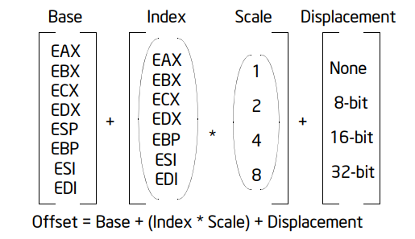

通用寄存器作为基址或索引的使用受到以下限制：

* ESP 寄存器不能用作索引寄存器。
* 当 ESP 或 EBP 寄存器用作基址时，默认段是 SS 段。在所有其他情况下，默认段是 DS 段。
* 基址、索引和偏移可以以任何组合使用，其中的任何一个都可以是 NULL。只有当同时使用索引时，
  才可以使用比例因子。每种可能的组合对于程序员在高级语言和汇编语言中常用的数据结构都是有
  用的。

以下是常见的地址组件组合及其用途：

* 仅有偏移：单独的偏移表示对操作数的直接（未计算的）偏移。由于偏移编码在指令中，这种地址
  形式有时称为绝对或静态地址。它通常用于访问静态分配的标量（scalar）操作数。

* 仅有基址：单独的基址表示对操作数的间接偏移。由于基址寄存器中的值可以变化，因此它可用于
  动态存储的变量和数据结构。

* 基址 + 偏移：基址寄存器和偏移可以一起用于两个不同的目的：

  作为数组的索引，当元素大小不是 2、4 或 8 字节时，偏移组件编码到数组开头的静态偏移。基
  址寄存器保存用于确定数组特定元素偏移量的计算结果。

  访问记录的字段：基址寄存器保存记录开头的地址，而偏移是到字段的静态偏移。

  这种组合的一个重要特殊用途是用于访问过程活动记录中的参数。过程活动记录是在进入过程时创
  建的栈帧。在这里，EBP 寄存器是基址寄存器的最佳选择，因为它自动选择栈段。这是这种通用功
  能的紧凑编码。

* (索引 * 比例因子) + 偏移：这种地址模式提供了一种有效的方式，用于索引静态数组，当元素
  大小为 2、4 或 8 字节时。偏移定位数组的开头，索引寄存器保存所需数组元素的下标，处理器
  自动通过应用比例因子将下标转换为索引。

* 基址 + 索引 + 偏移：一起使用两个寄存器支持二维数组（偏移保存数组开头的地址）或访问几个
  记录数组实例中的某一个（偏移是记录内部字段的偏移）。

* 基址 + (索引 * 比例因子) + 偏移：一起使用所有寻址组件允许有效地索引二维数组，当数组元
  素的大小为 2、4 或 8 字节时。

在 64 位模式下，内存地址的偏移部分可以直接指定为静态值，或者通过由以下一个或多个组件组成
的地址计算来指定：

* 偏移（Displacement）：一个 8 位、16 位或 32 位的值。
* 基址（Base）：一个 64 位通用寄存器中的值。
* 索引（Index）：一个 64 位通用寄存器中的值。
* 比例因子（Scale factor）：值为 2、4 或 8，与索引值相乘。

在大多数情况下，基址和索引可以在十六个可用的通用寄存器中指定。有关详细信息，参阅后文指令
格式部分。在 64 位模式下还可以使用以下独特的地址组合：

* RIP + 偏移：RIP 相对寻址使用一个带符号的 32 位偏移通过符号扩展并加上 RIP 中的 64 位
  值来计算下一条指令的有效地址。

在机器代码级别，偏移、基址寄存器、索引寄存器和比例因子的选定组合被编码在指令中。所有汇编
器都允许程序员使用这些寻址组件的任何允许组合来寻址操作数。高级语言编译器将根据程序员定义
的语言构造选择合适的这些组件的组合。

数据类型
=========

本章介绍了为 Intel 64 和 IA-32 架构定义的数据类型。本章末尾章节，还描述了在 x87 FPU 以
及 Intel SSE、SSE2、SSE3、SSSE3、SSE4 和 AVX 扩展中使用的实数和浮点概念。

基本类型
---------

基本数据类型包括字节、字、双字、四字和双四字：

* 字节（byte）等于八位（8 bits）
* 字（word）等于 2 字节（16 bits）
* 双字（doubleword）等于 4 字节（32 bits）
* 四字（quadword）等于 8 字节（64 bits）
* 双四字（double quadword）等于 16 字节（128 bits）

IA-32 架构指令的一个子集可以在没有额外操作数类型说明的情况下对这些基本数据类型进行操作。
四字数据类型是在 Intel486 处理器中引入 IA-32 架构的；双四字数据类型是在带有 Intel SSE
扩展的 Pentium III 处理器中引入的。

当在内存中作为操作数引用时，每种数据类型的最低字节（位 0 到 7）占据内存中的最低地址，而
那个地址也是操作数的地址。字、双字和四字不需要在内存的自然边界上对齐。字、双字和四字的自
然边界分别是偶数地址、能被四整除的地址和能被八整除的地址。然而，为了提高程序的性能，应尽
可能在自然边界上对齐数据结构（特别是栈）。原因是处理器需要两次内存访问来执行未对齐的内存
访问；对齐访问只需要一次内存访问。跨越 4 字节边界的字或双字操作数，或跨越 8 字节边界的四
字操作数被视为未对齐，并且需要两个单独的内存总线周期来访问。

一些操作双四字的指令要求内存操作数在自然边界上对齐。如果指定了未对齐的操作数，这些指令将
引发通用保护异常（#GP）。双四字的自然边界是任何能被 16 整除的地址。其他操作双四字的指令
允许未对齐访问（不引发通用保护异常）。然而，访问内存中的未对齐数据需要额外的内存总线周期。

数值类型
---------

尽管字节、字和双字是基本数据类型，但某些指令支持对这些数据类型的额外解释，以允许对数值数
据类型（有符号和无符号整数以及浮点数）执行操作。所有系列的 Intel SSE 扩展和 Intel AVX
扩展都支持单精度（32位）和双精度（64位）浮点数据类型。

半精度（16位）浮点数据类型最初仅在基于 Ivy Bridge 微架构的第三代 Intel Core 处理器开
始，通过 F16C 扩展（VCVTPH2PS 和 VCVTPS2PH）得到支持。从第四代 Intel Xeon 可扩展处理
器家族开始，增加了 Intel AVX-512 指令集架构（ISA），支持 16 位半精度浮点值（IEEE 标准
754-2019 中的 binary16，也称为半精度或 FP16）的广泛通用数值操作，这补充了 Intel Xeon
处理器产品中已经可用的 32 位和 64 位浮点指令。此 ISA 还为半精度浮点提供了复数值的原生硬
件支持。

数值类型的汇总如下图：

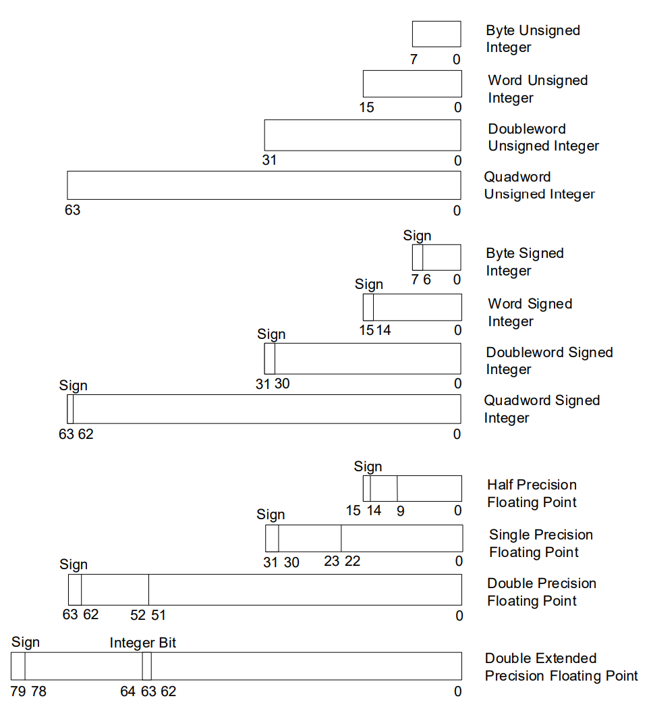

**整数类型**

在 Intel 64 和 IA-32 架构中，定义了两种类型的整数：无符号整数（unsigned integers）和
有符号整数（signed integers）。无符号整数是普通的二进制数，其取值范围从 0 到所选操作数
大小能表示的最大正数。有符号整数是使用二进制补码（two's complement）表示的二进制数，可
以表示正数和负数。

无符号整数的值范围如下：无符号字节整数（byte）从 0 到 255；无符号字整数（word）从 0 到
65,535；无符号双字整数（doubleword）从 0 到 2^32 − 1；无符号四字整数（quadword）从 0
到 2^64 − 1。无符号整数有时被称为序数（ordinals），因为它们常用于表示顺序或索引，而不能
表示负数。

一些整数指令，如 ADD、SUB、PADDB 和 PSUBB，可以对无符号或有符号整数操作数进行操作。而
其他整数指令，如 IMUL、MUL、IDIV、DIV、FIADD 和 FISUB，只对一种整数类型操作。

有符号整数是有符号的二进制数，存储在字节、字、双字或四字中。对有符号整数的所有操作都假设
使用二进制补码表示法。符号位位于字节整数的第 7 位、字整数的第 15 位、双字整数的第 31 位
以及四字整数的第 63 位。

符号位对于负整数被设置，对于正整数和零被清除。有符号整数的值范围如下：

* 字节整数：从 -128 到 +127
* 字整数：从 -32,768 到 +32,767
* 双字整数：从 -2,147,483,648 (–2^31) 到 +2,147,483,647 (2^31 − 1)
* 四字整数：从 -9,223,372,036,854,775,808 (–2^63) 到 +9,223,372,036,854,775,807 (2^63 − 1）

在内存中存储整数值时，字整数存储在 2 个连续的字节中；双字整数存储在 4 个连续的字节中；四
字整数存储在 8 个连续的字节中。

整数不定值（integer indefinite）是 x87 FPU 在处理整数值时有时返回的一个特殊值。有关更
多信息，请参阅不定值部分。

下图是有符号整数的编码格式：

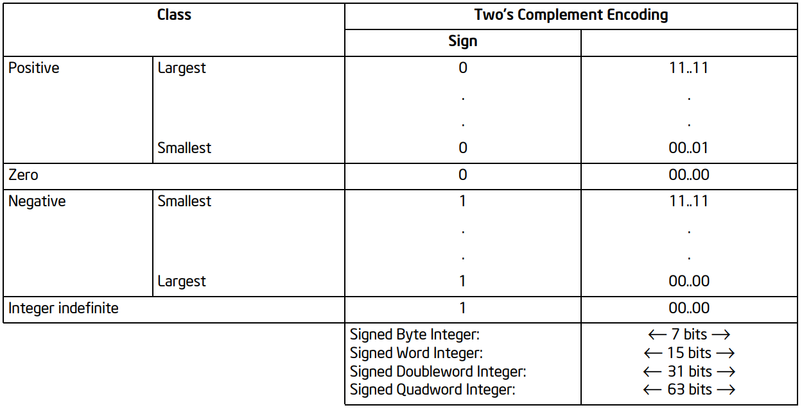

**浮点类型**

IA-32 架构定义并操作四种浮点数据类型：半精度浮点数、单精度浮点数、双精度浮点数和双扩展精
度浮点数。这些数据类型的数据格式直接对应于 IEEE 754 浮点数算术标准中指定的格式。

半精度（16位）浮点数据类型最初仅在基于 Ivy Bridge 微架构的第三代 Intel Core 处理器开始
支持，通过 F16C 扩展（VCVTPH2PS 和 VCVTPS2PH）实现。从第四代 Intel Xeon 可扩展处理器
家族开始，增加了针对 FP16 的 Intel AVX-512 指令集架构（ISA），支持 16 位半精度浮点值
（IEEE 754-2019 浮点数算术标准中的 binary16，也称为半精度或 FP16）的广泛通用数值操作，
这补充了 Intel Xeon 处理器产品中已经可用的 32 位和 64 位浮点指令。

下图提供了每种数据类型可以表示的长度、精度和近似规范化范围。每种类型也都支持非规范化值。
后面实数和浮点格式部分概述了 IEEE 754 浮点格式，并定义了整数位、QNaN、SNaN 和非规范化值
等术语。

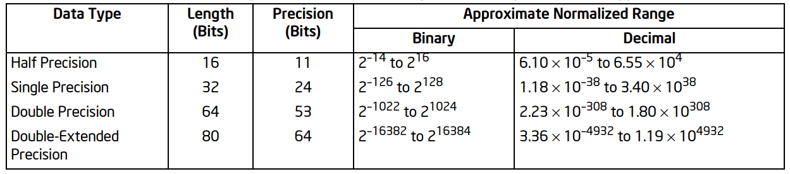

下图显示了三种浮点数据类型（半精度、单精度和双精度）的浮点编码，包括零、非规范化有限数、
规范化有限数、无限大和 NaN 的编码。它还提供了 QNaN 浮点不定值的格式。有关 QNaN 浮点不定
值用途的讨论，请参阅后文 QNaN 浮点不定值的内容。下图中的整数位是隐含的，没有保存在半精度、
单精度、双精度格式中。SNaN 编码的小数部分最高位是 0 但其他位必须不能为全零。

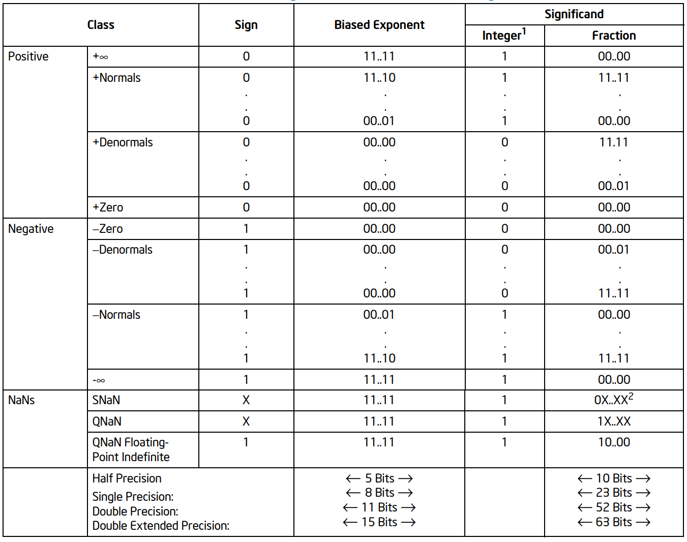

对于半精度、单精度和双精度格式，仅编码了小数的部分。所有数的整数位都假设为 1，除了 0 和
非规范化有限数之外。对于双扩展精度格式，整数位包含在第 63 位，最高有效位的分数位是第 62
位。这里对于规范化数、无限大和 NaN，整数位显式设置为 1，对于零和非规范化数则设置为 0。

每种浮点数据类型的指数都以偏置格式编码；有关详细信息，请参阅偏置指数部分的内容。偏置常数
分别为半精度格式 15、单精度格式 127、双精度格式 1023 和双扩展精度格式 16,383。

在内存中存储浮点值时，半精度值存储在内存中的 2 个连续字节中；单精度值存储在内存中的 4 个
连续字节中；双精度值存储在 8 个连续字节中；双扩展精度值存储在 10 个连续字节中。

单精度和双精度浮点数据类型由 x87 FPU 和 Intel SSE/SSE2/SSE3/SSE4.1/AVX 指令操作。双
扩展精度浮点格式仅由 x87 FPU 操作。有关 x87 FPU 和 Intel SSE/SSE2/SSE3 扩展之间单精度
和双精度浮点数据类型的兼容性讨论，请参阅后文 SIMD 和 x87 FPU 浮点数据类型的兼容性。

指针类型
---------

指针是内存位置的地址。在非 64 位模式下，架构定义了两种类型的指针：近指针（near pointer）
和远指针（far pointer）。近指针是一个 32 位（或 16 位）的偏移量（也称为有效地址），位于
一个段内。在平坦内存模型中的所有内存引用，或者在分段模型中，当被访问段的身份是隐含的时候，
都使用近指针。

远指针是一个逻辑地址，由一个 16 位的段选择器和一个 32 位（或 16 位）的偏移量组成。在分段
内存模型中，当必须明确指定被访问段的身份时，使用远指针。下图显示了带有 32 位偏移量的近指
针和远指针。

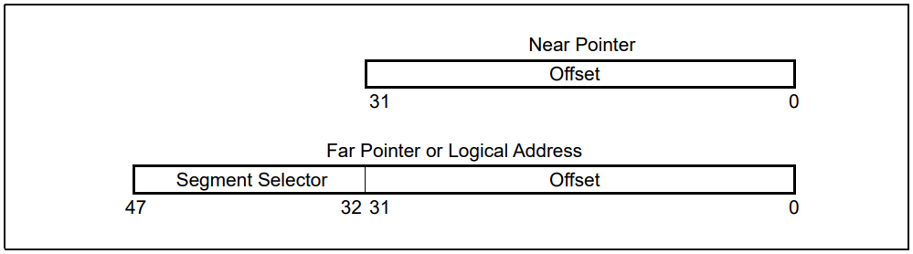

在 64 位模式（IA-32e 模式的子模式）下，近指针是 64 位的，这等同于有效地址。在 64 位模式
下，远指针可以是以下三种形式之一：

* 16 位段选择器，16 位偏移量：如果操作数大小是 32 位
* 16 位段选择器，32 位偏移量：如果操作数大小是 32 位
* 16 位段选择器，64 位偏移量：如果操作数大小是 64 位

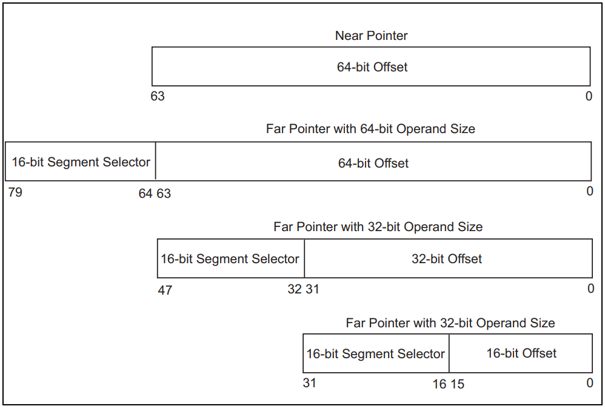

位域类型
---------

位域类型是一个连续的比特位。它可以从任何字节的任何比特位开始，并最多占据32个比特位：

字符串类型
----------

字符串是连续的比特、字节、字、双字序列。比特序列可以从任何字节的任何比特开始，最多包含
2^32 - 1 个比特。字节序列可以包含字节、字、双字，长度可以是 0 到 2^32 - 1 字节（4GB）。

SIMD 类型
----------

Intel 64 和 IA-32 架构定义并操作一组用于 SIMD（单指令多数据）操作的 64 位和 128 位打包
数据类型。这些数据类型由基本数据类型（打包字节、字、双字和四字）以及用于打包整数和打包浮
点操作的基本类型的数值解释组成。

64 位打包 SIMD 数据类型是在 Intel MMX 技术中引入 IA-32 架构的。它们在 MMX 寄存器中操
作。基本的 64 位打包数据类型包括打包字节、打包字和打包双字。在这些数据类型上执行数值 SIMD
操作时，这些数据类型被解释为包含字节、字或双字整数值。

128 位打包 SIMD 数据类型是在 Intel SSE 扩展中引入 IA-32 架构的，并与 Intel SSE2、SSE3、
SSSE3、SSE4.1 和 AVX 扩展一起使用。它们主要在 128 位 XMM 寄存器和内存中操作。基本的
128 位打包数据类型包括打包字节、打包字、打包双字和打包四字。在 XMM 寄存器中对这些基本数
据类型执行 SIMD 操作时，这些数据类型被解释为包含打包的或标量半精度浮点、单精度浮点或双精
度浮点值，或包含打包字节、字、双字或四字整数值。

BCD 类型
---------

二进制编码的十进制整数（BCD 整数）是无符号的 4 位整数，有效值范围从 0 到 9。IA-32 架构
定义了在一到多个通用寄存器或 x87 FPU 寄存器中对 BCD 整数的操作。如下图：

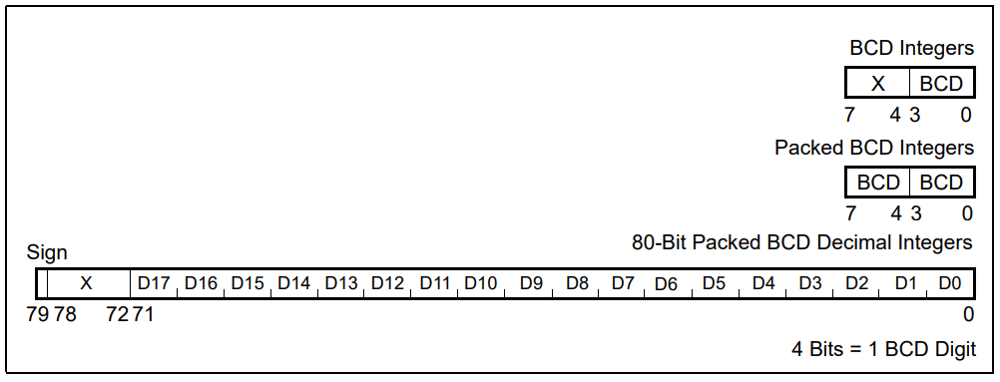

在通用寄存器上操作 BCD 整数时，BCD 值可以是解包的（每个字节一个 BCD 数字）或打包的（每
个字节两个 BCD 数字）。解包 BCD 整数的值是低半字节（位 0 到 3）的二进制值。高半字节（位
4 到 7）在加法和减法期间可以是任何值，但在乘法和除法期间必须为零。打包的 BCD 整数允许一
个字节内包含两个 BCD 数字。在这里，高半字节中的数字比低半字节中的数字更重要。

在 x87 FPU 数据寄存器上操作 BCD 整数时，BCD 值以 80 位格式打包，并被称为十进制整数。在
这种格式中，前 9 个字节包含 18 个 BCD 数字，每个字节包含 2 个数字。最低有效数字包含在字
节 0 的低半字节中，而最高有效数字包含在字节 9 的高半字节中。字节 10 的最高有效位包含符号
位（0 表示正数，1 表示负数；字节 10 的位 0 到 6 是无关位）。负十进制整数不以二进制补码
形式存储；它们仅通过符号位与正十进制整数区分。这种格式可以编码的十进制整数范围是 -10^18 + 1
到 10^18 - 1。

十进制整数格式仅存在于内存中。当十进制整数加载到 x87 FPU 数据寄存器时，它会自动转换为双
扩展精度浮点格式。所有十进制整数都可以精确表示为双扩展精度格式。

打包 BCD 整数的不定值（FFFFC000000000000000H）由 FBSTP 指令存储，作为对遮蔽浮点无效操
作异常的响应。尝试使用 FBLD 指令加载此值将产生未定义的结果。

下图是十进制整数数据类型的编码方式：

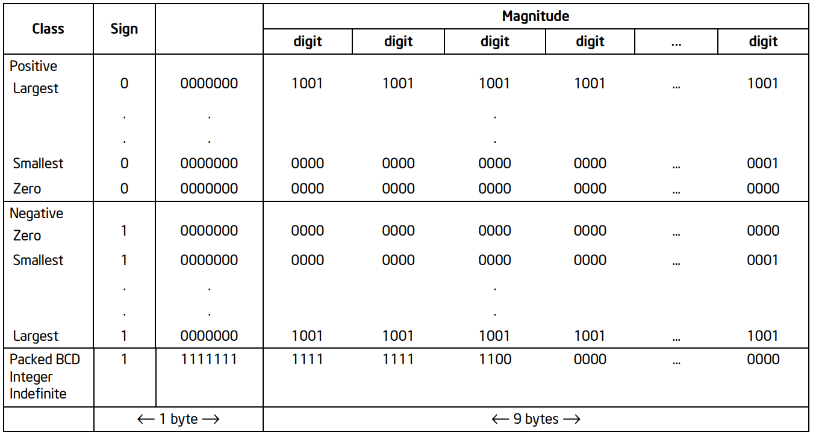

实数和浮点格式
--------------

浮点异常
---------

过程调用
=========

本章描述了 Intel 64 和 IA-32 架构中执行过程或子程序调用的设施。它还从应用程序程序员的
角度描述了如何处理中断和异常。

处理器以两种不同的方式支持过程调用：

* 使用 CALL 和 RET 指令
* 使用 ENTER 和 LEAVE 指令，与 CALL 和 RET 指令结合使用

这两种过程调用机制都使用过程栈（通常简称为栈），来保存调用过程的状态，向被调用过程传递参
数，以及存储当前执行过程的局部变量。处理器处理中断和异常的设施与 CALL 和 RET 指令使用的
设施类似。

支持控制流增强技术（Control-Flow Enforcement Technology, CET）的处理器支持一个额外的
栈，称为影子栈。当启用影子栈时，CALL 指令还会额外在影子栈上保存调用过程的状态；如果栈和
影子栈上的状态匹配，RET 指令将恢复调用过程的状态。影子栈是 CET 的一部分，它提供了额外的
安全层，以防止控制流劫持攻击。影子栈存储了与主栈相同的调用过程状态，但位于不同的内存区域。
CALL 指令在影子栈上保存调用过程的状态，而 RET 指令在返回前验证主栈和影子栈的状态是否匹
配。这种机制增加了安全性，因为攻击者更难操纵或预测影子栈的内容。

影子栈是一个专门用于控制权转移操作的第二个栈。这个栈与程序栈是分开的。影子栈不用于存储数
据，因此不会被软件显式写入。对影子栈的写入仅限于控制权转移指令和影子栈管理指令。影子栈可
以分别为特权级 3（用户模式）或特权级小于 3（监管模式）独立启用。影子栈只能在启用了分页的
保护模式下激活。在虚拟 8086 模式下执行的程序不能启用影子栈。

支持影子栈的处理器有一个称为影子栈指针（SSP）的架构寄存器，它指向影子栈的当前顶部。SSP
不能直接编码为指令中的源、目标或内存操作数。在 32 位/兼容模式下，影子堆栈的宽度为 32 位，
在 64 位模式下为 64 位。影子栈的地址大小属性在 32 位/兼容模式下为 32 位，在 64 位模式
下为 64 位。

远调用以及对中断或异常处理程序的调用时，影子栈的入栈和出栈的大小固定为 64 位，而在 32 位
或兼容模式下，这些操作使用 8 字节以及零字节填充的存储大小。

程序栈
-------

程序栈是内存位置的连续数组。它包含在段中，并通过 SS 寄存器中的段选择器标识。在使用平坦内
存模型时，栈可以位于程序线性地址空间的任何地方。栈的长度可以达到 4 GB，这是段的最大大小。
使用 PUSH 指令将项目放置在栈上，使用 POP 指令从栈中移除项目。

当项目被推到栈上时，处理器会递减 ESP 寄存器，然后在栈的新顶部写入项目。当项目从栈上弹出
时，处理器从栈顶部读取项目，然后递增 ESP 寄存器。以这种方式，当项目被推到栈上时，栈在内
存中向下（朝向较小地址）增长，当项目从栈上弹出时，栈向上（朝向较大地址）缩小。

程序或操作系统/执行体可以设置多个栈。例如，在多任务系统中，每个任务可以拥有自己的栈。系
统中栈的数量受到最大段数和可用物理内存的限制。当系统设置多个栈时，一次只有一个栈（当前栈）
可用。当前栈是被 SS 寄存器引用的段所包含的栈。处理器自动引用 SS 寄存器进行所有栈操作。例
如，当 ESP 寄存器用作内存地址时，它自动指向当前栈中的地址。此外，CALL、RET、PUSH、POP、
ENTER 和 LEAVE 指令都在当前栈上执行操作。

程序栈的内存结构如下：

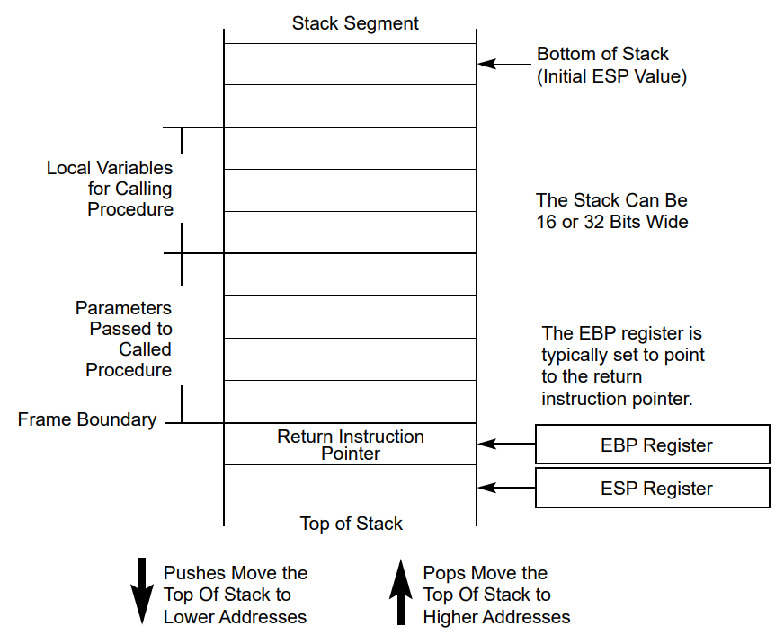

**设置栈**

要设置一个栈并将其设为当前栈，程序或操作系统/执行体必须执行以下步骤：

1. 建立栈段：首先，需要在内存中分配一个区域作为栈段，并设置适当的段描述符，包括段的基址、
   大小和属性（如可读写、可执行等）。
2. 将栈段的选择器加载到 SS 寄存器：使用 MOV、POP 或 LSS 指令。
3. 将栈指针加载到 ESP 寄存器：使用 MOV、POP 指令，或 LSS 指令可以在一次操作中同时加载
   SS 和 ESP 寄存器。

有关如何设置段描述符和栈段的段限制的信息，请参阅第三卷保护模式内存管理中的段描述符部分。

**栈对齐**

栈指针应该根据栈段的宽度对齐在 16 位（字）或 32 位（双字）边界上。当前代码段的段描述符中
的 D 标志设置了栈段宽度。PUSH 和 POP 指令使用 D 标志来确定在 push 或 pop 操作中堆栈指
针应该减少或增加多少。当堆栈宽度为 16 位时，栈指针以 16 位增量递增或递减；当宽度为 32
位时，栈指针以 32 位增量递增或递减。将 16 位值推入 32 位宽的栈可能导致栈未对齐（栈指针
没有在双字边界上对齐）。一个例外是当段寄存器的内容（一个 16 位段选择器）被推入 32 位宽的
栈时，处理器会自动将栈指针对齐到下一个 32 位边界。

处理器不检查栈指针对齐。维护栈指针的正确对齐是运行在处理器上的程序、任务和系统过程的责任。
栈指针未对齐可能导致严重的性能下降，某些情况下可能导致程序失败。

**地址属性**

使用栈的指令（如 PUSH 和 POP 指令）具有两个隐式地址大小属性，每个属性可以是 16 位或 32 位。
这是因为它们总是具有栈顶部的隐式地址，并且它们也可能具有显式内存地址（例如 PUSH Array1[EBX]）。
显式地址属性由当前代码段的 D 标志和 67H 地址大小前缀的存在与否决定。

堆顶部的地址大小属性决定了是使用 SP 还是 ESP 进行栈访问。具有 16 位地址大小属性的栈操作
使用 16 位 SP 栈指针寄存器，并且可以使用最大栈地址 FFFFH；具有 32 位地址大小属性的栈操
作使用 32 位 ESP 寄存器，并且可以使用最大地址 FFFFFFFFH。用作栈的数据段默认地址大小属性
由段描述符的 B 标志控制。当此标志清除时，默认地址大小属性为 16；当标志设置时，地址大小属
性为 32。

**64位模式中的栈**

在 64 位模式下，引用 SS 段的地址计算被视为段基址为零。段描述符寄存器中的字段（基址、限制
和属性）被忽略。SS DPL（栈段的特权级）被修改，使其始终等于 CPL（当前特权级）。即使 SS
描述符中只有这一字段被修改，这也将成立。

在 64 位模式下，处理器使用平坦的 64 位线性地址空间，而不是传统的段式内存模型。这意味着，
尽管 SS 寄存器仍然存在，但它的作用主要是用于跟踪栈段的特权级，而不是用于栈的寻址。因此，
与栈相关的指令（如 PUSH 和 POP）直接操作 RSP 寄存器，而不是通过 SS 寄存器来寻址。

寄存器 E(SP)、E(IP) 和 E(BP) 被提升为 64 位，并分别被重新命名为 RSP、RIP 和 RBP。一些
形式的段加载指令是无效的（例如 LDS，POP ES）。

PUSH/POP 指令使用 64 位宽度增加/减少栈。当段寄存器的内容被推送到 64 位栈上时，指针会自
动对齐到 64 位。

**过程调用信息**

处理器提供了两个用于过程调用的指针：栈帧基指针和返回指令指针。当与标准的软件过程调用技术
结合使用时，这些指针允许可靠和一致的过程调用。

堆栈通常被分成帧。每个栈帧随后可以包含局部变量、要传递给另一个过程的参数以及过程调用信息。
栈帧基指针（包含在 EBP 寄存器中）为被调用过程标识了栈帧内的一个固定参考点。如果要使用栈
帧基指针，被调过程在将任何局部变量推到栈上之前，必需将 ESP 寄存器的内容复制到 EBP 寄存器
中。然后，栈帧基指针允许轻松访问在栈上传递的数据结构、返回指令指针以及被调过程添加到栈的
局部变量。像 ESP 寄存器一样，EBP 寄存器自动指向当前栈段中的地址（即，由 SS 寄存器的当前
内容指定的段）。

在跳转到被调过程的第一个指令之前，CALL 指令将 EIP 寄存器中的地址推到当前栈上。这个地址
随后被称为返回指令指针，它指向在从被调过程返回后调用过程应该继续执行的指令。从被调过程返
回时，RET 指令将返回指令指针从栈中弹出并放回到 EIP 寄存器中。然后调用过程的执行继续。处
理器不跟踪返回指令指针的位置。因此，程序员需要确保在发出 RET 指令之前，栈指针指向栈上的
返回指令指针。将 EBP 寄存器的内容移动到 ESP 寄存器是将栈指针重置为指向返回指令指针的一种
常见方法。如果在过程调用后立即将 EBP 寄存器加载为栈指针，它应该指向栈上的返回指令指针。

处理器不要求返回指令指针重新指回到调用过程。在执行 RET 指令之前，返回指令指针可以在软件
中被操纵以指向当前代码段中的任何地址（近返回）或另一个代码段中的地址（远返回）。然而，执
行这样的操作应该非常谨慎，只使用谨慎定义的代码入口。

