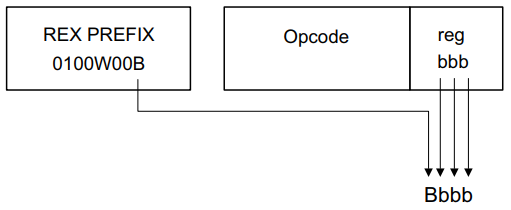

处理器指令格式

* `指令格式`_

  * `指令前缀`_
  * `操作码`_
  * `寻址形式说明符`_
  * `偏移量和立即数`_
  * `ModR/M 和 SIB`_

* `64 位格式`_

  * `编码说明`_
  * `REX 前缀字段`_
  * `地址偏移`_
  * `操作数`_
  * `RIP 相对寻址`_

* `AVX 扩展格式`_

* `指令参考说明`_

  * `操作码信息`_
  * `带VEX前缀的操作码`_
  * `指令信息`_
  * `操作数编码`_
  * `64/32位模式`_
  * `CPUID特性标志`_
  * `描述说明`_
  * `操作说明`_
  * `内在函数说明`_
  * `影响标志位`_
  * `影响FPU标志位`_
  * `不同模式下的异常`_
  * `浮点异常说明`_
  * `SIMD浮点异常说明`_

* `机器编码汇总`_

本章描述了所有 Intel 64 和 IA-32 处理器的指令格式。保护模式、实地址模式和虚拟 8086 模
式的指令格式在第一部分介绍，IA-32e 模式及其子模式的不同内容在第二部分描述。

指令格式
=========

Intel 64 和 IA-32 架构的指令编码是如下图所示格式的子集。指令由以下部分组成：

* 可选的指令前缀：可以有任意顺序的零个或多个指令前缀，用于修改指令的行为，如改变操作数大
  小或指定特殊操作，每个指令前缀为一个字节
* 主要操作码字节：最多三个字节，用于指定要执行的操作
* 寻址形式说明符：如果需要，包含 ModR/M 字节（2-bit mod 3-bit reg/op 3-bit r/m），有
  时还包括 SIB（2-bit scale 3-bit index 3-bit base）字节，因此 ModR/M 和 SIB 字节序
  列长度从零字节到两个字节
* 偏移量（Displacement）：如果需要，指定内存地址的偏移量，长度零、一、二、四个字节
* 立即数字段：如果需要，提供指令直接操作的数据，长度零、一、二、四个字节

.. image:: image/insformat.png
    :width: 70%

REX 前缀是可选的，但如果使用，它的后面必须紧跟操作码字段。对于 VEX 前缀见 VEX 扩展格式
部分。很少一部分指令的偏移量字段和立即数字段的长度可能为八字节。

指令前缀
---------

指令前缀被分为四组，每组都有一组允许的前缀代码。对于每条指令，只允许包含来自四组中的每个
组的一个前缀代码，但相对顺序可以是任意的。

第一组

锁定和重复前缀：

* LOCK 前缀 F0H
* REPNE/REPNZ 前缀 F2H，仅适用于字符串和输入/输出指令，还被用作某些指令的强制前缀
* REP 或 REPE/REPZ 前缀 F3H，仅适用于字符串和输入/输出指令，还被用作某些指令的强制前缀

边界（BND）前缀被编码为 F2H，当满足以下条件：

* CPUID.(EAX=07H, ECX=0):EBX.MPX[bit 14] 被设置
* BNDCFGU.EN 和/或 IA32_BNDCFGS.EN 被设置
* 当 F2 前缀位于近 CALL、近 RET、近 JMP、短 Jcc 或近 Jcc 指令之前

第二组

段覆盖前缀，这些前缀用于覆盖默认段寄存器，指定内存操作应该使用的段：

* 2EH — CS 段前缀（与任何分支指令一起使用时是保留暂未定义的）
* 36H — SS 段覆盖前缀（与任何分支指令一起使用时保留）
* 3EH — DS 段覆盖前缀（与任何分支指令一起使用时保留）
* 26H — ES 段覆盖前缀（与任何分支指令一起使用时保留）
* 64H — FS 段覆盖前缀（与任何分支指令一起使用时保留）
* 65H — GS 段覆盖前缀（与任何分支指令一起使用时保留）

分支提示（Branch Hints），分支提示用于给处理器提供关于分支方向的非强制性建议，以优化流
水线性能：

* 2EH — 分支不采取（仅与 Jcc 指令一起使用）
* 3EH — 分支采取（仅与 Jcc 指令一起使用）

不同的微架构可能行为不同，具体细节和优化建议参考《Intel 64 和 IA-32 架构优化参考手册》。

第三组

操作数大小覆盖前缀：

* 66H — 用于指定操作数的大小为 16 位或 32 位，而不是默认的大小；66H 也被用作某些指令的
  强制性前缀

第四组

地址大小覆盖前缀：

* 67H — 用于指定内存地址的大小为 16 位或 32 位，而不是默认的大小

锁定前缀（F0H）强制执行一项操作，确保在多处理器环境中对共享内存的独占使用。有关此前缀的
描述，请参见 A-L指令集参考中的“锁定—断言LOCK#信号前缀”。

重复前缀（F2H、F3H）使指令对字符串的元素执行重复操作，仅与字符串和I/O指令（MOVS、CMPS、
SCAS、LODS、STOS、INS和OUTS）一起使用。在其他 Intel 64 或 IA-32 指令中使用重复前缀或
未定义操作码是保留的，这种使用可能导致不可预测的行为。某些指令可能使用 F2H 或 F3H 作为
强制性前缀来表达不同的功能。

分支提示前缀（2EH、3EH）允许程序在条件分支指令（Jcc）上给处理器一个提示，关于分支的最可
能的代码路径。

操作数大小覆盖前缀允许程序在 16 位和 32 位操作数大小之间切换。两种大小都可以是默认值，使
用此前缀选择非默认大小。一些 SSE2/SSE3/SSSE3/SSE4 指令和使用三个字节主操作码序列的指令
可能使用 66H 作为强制性前缀来表达不同的功能。66H 前缀的其他使用是保留的，这种使用可能会
导致不可预测的行为。

地址大小覆盖前缀（67H）允许程序在 16 位和 32 位寻址之间切换。两种大小都可以是默认值，该
前缀选择非默认大小。当指令的操作数不位于内存中时，使用此前缀和/或其他未定义的操作码是保留
的，这种使用可能会导致不可预测的行为。

操作码
-------

主要操作码长度可以是 1、2 或 3 字节，有时在 ModR/M 字节中另外编码一个 3 比特的操作码字
段。在主要操作码内部可以定义较小的字段，这些字段定义了操作的方向、偏移量的大小、寄存器编
码、条件码或符号扩展。操作码使用的编码字段取决于操作类别而各有不同。

通用、SIMD 指令的两字节操作码格式由以下之一组成：

1. 转义操作码字节 0FH 作为主要操作码、和一个第二操作码字节
2. 强制前缀（66H、F2H 或 F3H）、转义操作码字节、和一个第二操作码字节

例如，CVTDQ2PD 由以下序列组成：F3 0F E6，第一个字节是强制性前缀。

通用、SIMD 指令的三字节操作码格式由以下之一组成：

1. 转义操作码字节 0FH 作为主要操作码，加上两个额外的操作码字节
2. 强制性前缀（66H、F2H 或 F3H）、转义操作码字节，加上两个额外的操作码字节

例如，XMM 寄存器的 PHADDW 由以下序列组成：66 0F 38 01，第一个字节是强制性前缀。

有效的操作码表达式见操作码映射表，以及指令编码部分。

寻址形式说明符
--------------

许多引用内存操作数的指令在主要操作码之后都有一个寻址形式说明符字节（称为 ModR/M 字节）。
ModR/M 字节包含三个字段的信息：

* 两比特 mod 字段：与 r/m 字段结合，形成 32 个可能的值：8 个寄存器和 24 种寻址模式。
* 三比特 reg/opcode 字段：指定寄存器编号或另外三位操作码信息。reg/opcode 字段的目的在
  主要操作码中指定。
* 三比特 r/m 字段：可以指定寄存器作为操作数，或者与 mod 字段结合以编码寻址模式。有时，
  mod 字段 和 r/m 字段的某些组合用于表达某些指令的操作码信息。

某些 ModR/M 字节的编码需要第二个寻址字节（SIB 字节）。基址加索引、比例加索引形式的32位
寻址需要 SIB 字节。SIB 字节包括以下字段：

* 两比特 scale 字段：指定缩放因子。
* 三比特 index 字段：指定索引寄存器的寄存器编号。
* 三比特 base 字段：指定基址寄存器的寄存器编号。

有关 ModR/M 和 SIB 字节的编码，参见 `ModR/M 和 SIB`_ 。

偏移量和立即数
--------------

一些寻址形式包括紧跟在 ModR/M 字节之后的偏移量（如果存在 SIB 字节，则紧跟在 SIB 字节之
后）。如果需要偏移量，它可以是 1、2 或 4 字节。

如果指令指定了一个立即操作数，该操作数总是跟在任何偏移量字节之后。立即操作数可以是 1、2
或 4 字节。

ModR/M 和 SIB
--------------

ModR/M 和 SIB 字节的值及其对应的寻址形式在表一到表三中显示：

- 表一显示了由 ModR/M 字节指定的 16 位寻址形式。
- 表二显示了由 ModR/M 字节指定的 32 位寻址形式。
- 表三显示了由 SIB 字节指定的 32 位寻址形式。

当 ModR/M 字节的 reg/opcode 字段表示扩展操作码时，对应的有效编码在指令编码中描述。在表
一和表二中，“有效地址” 列列出了可以分配给指令第一个操作数的32位有效地址，该地址使用了
ModR/M 字节的 mod 和 r/m 字段。前 24 个选项提供了指定内存位置的方法；最后八个（mod=11B）
提供了指定通用寄存器、MMX 技术和 XMM 寄存器的方法。

表一和表二中的 mod 和 r/m 列给出了获得第一列中列出的有效地址所需的 mod 和 r/m 字段的二
进制编码。例如 mod=11B r/m=000B 的行，标识了通用寄存器 EAX、AX 或 AL；MMX 技术寄存器
MM0；或 XMM 寄存器 XMM0。所使用的寄存器由操作码字节和操作数大小属性决定。

表中的 “REG=” 行指定了三比特 reg/opcode 字段的使用，当该字段用于给出第二个操作数的位置
时。第二操作数必须是一个通用寄存器、MMX 技术或 XMM 寄存器。第一行到第五行列出了可能对应
于表中值的寄存器。同样，所使用的寄存器由操作码字节以及操作数大小属性决定。

如果指令不需要第二个操作数，则 reg/opcode 字段可以用作操作码扩展。这种用法在表格中的第
六行 “/digit (Opcode)” 中表示。请注意，第六行中的值以十进制形式表示。

表一和表二的主体 “ModR/M 字节的值（十六进制）” 包含一个 32x8 数组，展示了所有 256 个
ModR/M 字节的值（以十六进制表示）。ModR/M 字节对应的值示例如下： ::

                     mod 11
    /digit (opcode); reg   001
                     r/m      000
    -----------------------------
                     C8H 11001000

表一：由 ModR/M 字节指定的 16 位寻址形式 ::

    r8(/r)                          AL   CL   DL   BL   AH   CH   DH   BH
    r16(/r)                         AX   CX   DX   BX   SP   BP¹  SI   DI
    r32(/r)                         EAX  ECX  EDX  EBX  ESP  EBP  ESI  EDI
    mm(/r)                          MM0  MM1  MM2  MM3  MM4  MM5  MM6  MM7
    xmm(/r)                         XMM0 XMM1 XMM2 XMM3 XMM4 XMM5 XMM6 XMM7
    /ditit(opcode)                  0    1    2    3    4    5    6    7
    REG=                            000  001  010  011  100  101  110  111
    有效地址            mod r/m     ModR/M字节对应的值（十六进制）
    [BX+SI]            00  000      00   08   10   18   20   28   30   38
    [BX+DI]                001      01   09   11   19   21   29   31   39
    [BP+SI]                010      02   0A   12   1A   22   2A   32   3A
    [BP+DI]                011      03   0B   13   1B   23   2B   33   3B
    [SI]                   100      04   0C   14   1C   24   2C   34   3C
    [DI]                   101      05   0D   15   1D   25   2D   35   3D
    disp16²                110      06   0E   16   1E   26   2E   36   3E
    [BX]                   111      07   0F   17   1F   27   2F   37   3F
    [BX+SI]+disp8³     01  000      40   48   50   58   60   68   70   78
    [BX+DI]+disp8          001      41   49   51   59   61   69   71   79
    [BP+SI]+disp8          010      42   4A   52   5A   62   6A   72   7A
    [BP+DI]+disp8          011      43   4B   53   5B   63   6B   73   7B
    [SI]+disp8             100      44   4C   54   5C   64   6C   74   7C
    [DI]+disp8             101      45   4D   55   5D   65   6D   75   7D
    [BP]+disp8             110      46   4E   56   5E   66   6E   76   7E
    [BX]+disp8             111      47   4F   57   5F   67   6F   77   7F
    [BX+SI]+disp16     10  000      80   88   90   98   A0   A8   B0   B8
    [BX+DI]+disp16         001      81   89   91   99   A1   A9   B1   B9
    [BP+SI]+disp16         010      82   8A   92   9A   A2   AA   B2   BA
    [BP+DI]+disp16         011      83   8B   93   9B   A3   AB   B3   BB
    [SI]+disp16            100      84   8C   94   9C   A4   AC   B4   BC
    [DI]+disp16            101      85   8D   95   9D   A5   AD   B5   BD
    [BP]+disp16            110      86   8E   96   9E   A6   AE   B6   BE
    [BX]+disp16            111      87   8F   97   9F   A7   AF   B7   BF
    EAX/AX/AL/MM0/XMM0 11  000      C0   C8   D0   D8   E0   E8   F0   F8
    ECX/CX/CL/MM1/XMM1     001      C1   C9   D1   D9   E1   E9   F1   F9
    EDX/DX/DL/MM2/XMM2     010      C2   CA   D2   DA   E2   EA   F2   FA
    EBX/BX/BL/MM3/XMM3     011      C3   CB   D3   DB   E3   EB   F3   FB
    ESP/SP/AH/MM4/XMM4     100      C4   CC   D4   DC   E4   EC   F4   FC
    EBP/BP/CH/MM5/XMM5     101      C5   CD   D5   DD   E5   ED   F5   FD
    ESI/SI/DH/MM6/XMM6     110      C6   CE   D6   DE   E6   EE   F6   FE
    EDI/DI/BH/MM7/XMM7     111      C7   CF   D7   DF   E7   EF   F7   FF

    1. 默认段寄存器对于包含 BP 索引的有效地址是 SS，对于其他有效地址是 DS
    2. disp16 表示跟随 ModR/M 字节之后的 16 位偏移量，该偏移被加到索引上
    3. disp8 表示跟随 ModR/M 字节之后的 8 位偏移量，该偏移被符号扩展并加到索引上

表二：ModR/M 字节指定的 32 位寻址形式 ::

    r8(/r)                          AL   CL   DL   BL   AH   CH   DH   BH
    r16(/r)                         AX   CX   DX   BX   SP   BP   SI   DI
    r32(/r)                         EAX  ECX  EDX  EBX  ESP  EBP  ESI  EDI
    mm(/r)                          MM0  MM1  MM2  MM3  MM4  MM5  MM6  MM7
    xmm(/r)                         XMM0 XMM1 XMM2 XMM3 XMM4 XMM5 XMM6 XMM7
    /ditit(opcode)                  0    1    2    3    4    5    6    7
    REG=                            000  001  010  011  100  101  110  111
    有效地址            mod r/m     ModR/M字节对应的值（十六进制）
    [EAX]              00  000      00   08   10   18   20   28   30   38
    [ECX]                  001      01   09   11   19   21   29   31   39
    [EDX]                  010      02   0A   12   1A   22   2A   32   3A
    [EBX]                  011      03   0B   13   1B   23   2B   33   3B
    [-][-]¹                100      04   0C   14   1C   24   2C   34   3C
    disp32²                101      05   0D   15   1D   25   2D   35   3D
    [ESI]                  110      06   0E   16   1E   26   2E   36   3E
    [EDI]                  111      07   0F   17   1F   27   2F   37   3F
    [EAX]+disp8³       01  000      40   48   50   58   60   68   70   78
    [ECX]+disp8            001      41   49   51   59   61   69   71   79
    [EDX]+disp8            010      42   4A   52   5A   62   6A   72   7A
    [EBX]+disp8            011      43   4B   53   5B   63   6B   73   7B
    [-][-]+disp8           100      44   4C   54   5C   64   6C   74   7C
    [EBP]+disp8            101      45   4D   55   5D   65   6D   75   7D
    [ESI]+disp8            110      46   4E   56   5E   66   6E   76   7E
    [EDI]+disp8            111      47   4F   57   5F   67   6F   77   7F
    [EAX]+disp32       10  000      80   88   90   98   A0   A8   B0   B8
    [ECX]+disp32           001      81   89   91   99   A1   A9   B1   B9
    [EDX]+disp32           010      82   8A   92   9A   A2   AA   B2   BA
    [EBX]+disp32           011      83   8B   93   9B   A3   AB   B3   BB
    [-][-]+disp32          100      84   8C   94   9C   A4   AC   B4   BC
    [EBP]+disp32           101      85   8D   95   9D   A5   AD   B5   BD
    [ESI]+disp32           110      86   8E   96   9E   A6   AE   B6   BE
    [EDI]+disp32           111      87   8F   97   9F   A7   AF   B7   BF
    EAX/AX/AL/MM0/XMM0 11  000      C0   C8   D0   D8   E0   E8   F0   F8
    ECX/CX/CL/MM1/XMM1     001      C1   C9   D1   D9   E1   E9   F1   F9
    EDX/DX/DL/MM2/XMM2     010      C2   CA   D2   DA   E2   EA   F2   FA
    EBX/BX/BL/MM3/XMM3     011      C3   CB   D3   DB   E3   EB   F3   FB
    ESP/SP/AH/MM4/XMM4     100      C4   CC   D4   DC   E4   EC   F4   FC
    EBP/BP/CH/MM5/XMM5     101      C5   CD   D5   DD   E5   ED   F5   FD
    ESI/SI/DH/MM6/XMM6     110      C6   CE   D6   DE   E6   EE   F6   FE
    EDI/DI/BH/MM7/XMM7     111      C7   CF   D7   DF   E7   EF   F7   FF

    1. [-][-] 表示 ModR/M 字节后跟有一个 SIB 字节
    2. disp32 表示跟随在 ModR/M 字节（或如果存在则 SIB 字节）之后的 32 位偏移量，该偏
       移被加到索引上
    3. disp8 表示跟随在 ModR/M 字节（或如果存在则 SIB 字节）之后的 8 位偏移量，该偏移
       被符号扩展并加到索引上

下表组织了 SIB 字节的 256 个可能值（以十六进制表示）。用作基址的通用寄存器在表的顶部指
示，以及 SIB 字节的基址字段的相应值。表的主体展示了 SIB 字段中的索引（bit3~5）和缩放因
子（bit6~7）。

表三：由 SIB 字节指定的 32 位寻址形式 ::

    r32                     EAX  ECX  EDX  EBX  ESP  [*]  ESI  EDI
    base=                   0    1    2    3    4    5    6    7
    ----------------------- 000  001  010  011  100  101  110  111
    缩放索引 scale index     SIB字节对应的值（十六进制）
    [EAX]      00  000      00   01   02   03   04   05   06   07
    [ECX]          001      08   09   0A   0B   0C   0D   0E   0F
    [EDX]          010      10   11   12   13   14   15   16   17
    [EBX]          011      18   19   1A   1B   1C   1D   1E   1F
    none           100      20   21   22   23   24   25   26   27
    [EBP]          101      28   29   2A   2B   2C   2D   2E   2F
    [ESI]          110      30   31   32   33   34   35   36   37
    [EDI]          111      38   39   3A   3B   3C   3D   3E   3F
    [EAX*2]    01  000      40   41   42   43   44   45   46   47
    [ECX*2]        001      48   49   4A   4B   4C   4D   4E   4F
    [EDX*2]        010      50   51   52   53   54   55   56   57
    [EBX*2]        011      58   59   5A   5B   5C   5D   5E   5F
    none           100      60   61   62   63   64   65   66   67
    [EBP*2]        101      68   69   6A   6B   6C   6D   6E   6F
    [ESI*2]        110      70   71   72   73   74   75   76   77
    [EDI*2]        111      78   79   7A   7B   7C   7D   7E   7F
    [EAX*4]    10  000      80   81   82   83   84   85   86   87
    [ECX*4]        001      88   89   8A   8B   8C   8D   8E   8F
    [EDX*4]        010      90   91   92   93   94   95   96   97
    [EBX*4]        011      98   99   9A   9B   9C   9D   9E   9F
    none           100      A0   A1   A2   A3   A4   A5   A6   A7
    [EBP*4]        101      A8   A9   AA   AB   AC   AD   AE   AF
    [ESI*4]        110      B0   B1   B2   B3   B4   B5   B6   B7
    [EDI*4]        111      B8   B9   BA   BB   BC   BD   BE   BF
    [EAX*8]    11  000      C0   C1   C2   C3   C4   C5   C6   C7
    [ECX*8]        001      C8   C9   CA   CB   CC   CD   CE   CF
    [EDX*8]        010      D0   D1   D2   D3   D4   D5   D6   D7
    [EBX*8]        011      D8   D9   DA   DB   DC   DD   DE   DF
    none           100      E0   E1   E2   E3   E4   E5   E6   E7
    [EBP*8]        101      E8   E9   EA   EB   EC   ED   EE   EF
    [ESI*8]        110      F0   F1   F2   F3   F4   F5   F6   F7
    [EDI*8]        111      F8   F9   FA   FB   FC   FD   FE   FF

    [*] 表示一个没有 base 的 disp32（当mod=00时），或者 disp8/disp32 + [EBP]:
    mod=    有效地址
    00      [缩放索引] + disp32
    01      [缩放索引] + disp8 + [EBP]
    10      [缩放索引] + disp32 + [EBP]

64 位格式
==========

Intel 64 架构的 IA-32e 模式，包含两个子模式：

* 兼容模式（Compatibility Mode）：允许 64 位操作系统运行大多数传统的保护模式软件，而无
  需修改。这种模式主要用于向后兼容 32 位应用程序，使它们能够在 64 位操作系统上运行。
* 64 位模式（64-Bit Mode）：允许 64 位操作系统运行为访问 64 位地址空间而编写的应用程序。
  这种模式提供了对更大内存空间的访问能力，并且支持 64 位宽的寄存器和操作数。

REX（register extension）前缀是 64 位模式下使用的指令前缀字节。它们执行以下操作：

* 指定通用寄存器（GPRs）和 SSE 寄存器：REX 前缀允许访问扩展的通用寄存器和 SSE 寄存器，
  例如使用 R8 到 R15 的寄存器。
* 指定 64 位操作数大小：REX 前缀用于指定操作数为 64 位，这在处理 64 位数据时是必要的。
* 指定扩展控制寄存器：REX 前缀还用于访问扩展的控制寄存器。

并非所有 64 位模式下的指令都需要 REX 前缀。只有当指令引用扩展寄存器或字节寄存器 SPL、
BPL、SIL、DIL 之一，或使用 64 位操作数时，才需要 REX 前缀。如果指令不需要 REX 前缀，
或者 REX 前缀没有立即前置于它需要的指令操作码字节或转义操作码字节（0FH），则 REX 前缀将
被忽略。这意味着只有一个正确放置的 REX 前缀才可以影响指令。

当 REX 前缀与包含强制性前缀的指令结合使用时，强制性前缀必须位于 REX 前缀之前，以便 REX
前缀能够立即前置于操作码或转义字节。例如，带有 REX 前缀的 CVTDQ2PD 应该在 F3 和 0F E6
之间放置 REX。其他放置方式将被忽略。带有 REX 前缀的指令仍然适用指令大小的 15 字节限制。
如下图指令前缀顺序：

编码说明
--------

Intel 64 和 IA-32 指令格式根据编码中的 3 个比特位字段来指定最多三个寄存器：

1. ModR/M：ModR/M 字节中的 reg 和 r/m 字段
2. 带有 SIB 的 ModR/M：ModR/M 字节中的 reg 字段，以及 SIB（scale, index, base）字节
   中的 base 和 index 字段
3. 不带 ModR/M 的指令：操作码中的 reg 字段

在 64 位模式下，这些格式并没有改变。定义 64 位上下文中的字段所需的位通过添加 REX 前缀来
提供。

在 64 位模式下，为控制寄存器和调试寄存器提供了一些额外编码。REX.R 位用于修改 ModR/M reg
字段，当该字段编码控制寄存器或调试寄存器时。这些编码使得处理器能够寻址 CR8 ~ CR15 和
DR8 ~ DR15。在 64 位模式中定义了一个额外的控制寄存器（CR8），也称为任务优先寄存器（TPR）。

在 IA-32e 模式的首个实现中，CR9 ~ CR15 和 DR8 ~ DR15 并未实现。任何尝试访问未实现寄存
器的操作都会导致无效操作码异常（#UD）。

REX 前缀字段
------------

REX 前缀是一组 16 个操作码，它们跨越操作码表的一行，占据 40H 到 4FH 的条目。这些操作码
在 IA-32 操作模式和兼容性模式中代表有效的指令（INC 或 DEC）。在 64 位模式下，相同的操作
码代表指令前缀 REX，并不被视为单独的指令。64 位模式下不可用单字节操作码形式的 INC/DEC
指令。INC/DEC 功能仍然可以通过相同指令的 ModR/M 形式使用（操作码 FF/0 和 FF/1）。

以下是 REX 前缀字节的格式 [BITS: 0100WRXB]： ::
    
    比特位      名称    定义
    bit7~4      无      0100
    bit3        W       0 表示操作数大小由 CS.D 决定，1 表示64位操作数大小
    bit2        R       ModR/M reg 字段扩展
    bit1        X       SIB index 字段扩展
    bit0        B       对 ModR/M r/m 字段、SIB base 字段、或 Opcode reg 字段的扩展

REX 前缀字段的某些组合是无效的，在这种情况下，前缀被忽略。以下是一些附加信息：

- 设置 REX.W 可以用来确定操作数大小，但并不单独确定操作数宽度。像 66H 尺寸前缀一样，64
  位操作数大小覆盖对字节特定操作无效。
- 对于非字节操作：如果使用 66H 前缀与前缀（REX.W = 1），则忽略 66H。
- 如果在使用 REX 时使用了 66H 覆盖，并且 REX.W = 0，则操作数大小为 16 位。
- REX.R 修改 ModR/M 寄存器字段，当该字段编码一个通用寄存器、SSE、控制或调试寄存器时。当
  ModR/M 指定其他寄存器或定义扩展操作码时，会忽略 REX.R。
- REX.X 位修改 SIB 索引字段。
- REX.B 要么修改 ModR/M r/m 字段或 SIB 基址字段；要么修改用于访问通用寄存器的 Opcode
  reg 字段。

不使用 SIB 也不使用 REX.X 的内存寻址的例子：

不使用 REX.X 的无内存操作数的寻址：

使用 SIB 的内存寻址：

REX.X 和 REX.R 都没使用的在 Opcode 中编码的寄存器操作数：

在 IA-32 架构中，字节寄存器（AH、AL、BH、BL、CH、CL、DH 和 DL）被编码在 ModR/M 字节的
reg 字段、r/m 字段或操作码 reg 字段中，作为寄存器 0 到 7。REX 前缀为字节寄存器提供了额
外的寻址能力，使得通用寄存器的最低有效字节可以用于字节操作。ModR/M 字节和 SIB 字节的某
些字段组合对寄存器编码具有特殊含义。对于一些组合，REX 前缀扩展的字段不会被解码。下表描述
了 REX 前缀编码的所有特殊情况：

地址偏移
---------

在 64 位模式下，寻址使用现有的 32 位 ModR/M 和 SIB 编码。ModR/M 和 SIB 的偏移大小不会
改变，它们保持 8 位或 32 位，最后通过符号位扩展拉伸到 64 位。

在 64 位模式下，MOV 指令的直接内存偏移形式被扩展以指定一个 64 位的立即绝对地址。这个地
址被称为 moffset。指定这个 64 位内存偏移不需要前缀。对于这些 MOV 指令，内存偏移的大小遵
循地址大小默认值（在 64 位模式下为 64 位）。直接内存偏移形式的 MOV 指令如下： ::

    操作码      指令
    A0          MOV AL, moffset
    A1          MOV EAX, moffset
    A2          MOV moffset, AL
    A3          MOV moffset, EAX

操作数
-------

在 64 位模式下，立即操作数的典型大小仍然是 32 位。当操作数大小为 64 位时，处理器会在使
用之前将所有立即数符号扩展到 64 位。

对 64 位立即操作数的支持是通过扩展现有的移动（MOV reg, imm16/32）指令的语义来实现的。
这些指令（操作码 B8H 到 BFH）将 16 位或 32 位的立即数据（取决于有效操作数大小）移动到通
用寄存器（GPR）中。当有效操作数大小为 64 位时，这些指令可以用来将立即数加载到 GPR 中。
需要一个 REX 前缀来覆盖 32 位默认操作数大小到 64 位操作数大小。

例如： ::

    48 B8 8877665544332211 MOV RAX,1122334455667788H

在 64 位模式下，有两组指令默认操作数大小为 64 位（不需要 REX 前缀来指定此操作数大小）。
这些指令包括：

1. 近分支（Near branches）：这些是跳转指令，它们在代码中跳转到距离当前位置较近的位置。
   在 64 位模式下，这些分支指令的默认目标地址是 64 位的，因此不需要额外的前缀来指定操作
   数大小。
2. 除了远分支外的所有隐式引用 RSP 的指令，：这包括如 PUSH、POP、CALL 和 RET 等指令，它
   们操作栈指针 RSP。在 64 位模式下，这些指令默认使用 64 位的栈指针，因此也不需要 REX
   前缀。

RIP 相对寻址
------------

在 64 位模式下，实现了一种新的寻址形式，即 RIP 相对寻址（相对于指令指针）。有效地址是通
过将偏移添加到下一条指令的 64 位 RIP 上形成的。

在 IA-32 架构和兼容模式中，只有控制权转移指令才能使用相对于指令指针的寻址。在 64 位模式
下，使用 ModR/M 寻址的指令可以使用 RIP 相对寻址。没有 RIP 相对寻址，所有 ModR/M 模式都
相对于零寻址内存。

RIP 相对寻址允许特定的 ModR/M 模式使用带符号的 32 位偏移相对于 64 位 RIP 寻址内存。这
提供了从 RIP 起 ±2GB 的偏移范围。下图显示了 RIP 相对寻址的 ModR/M 和 SIB 编码。在当前
的 ModR/M 和 SIB 编码中，存在 32 位偏移寻址的冗余形式。有一个 ModR/M 编码，并且有多个
SIB 编码。RIP 相对寻址使用冗余形式编码。在 64 位模式下，ModR/M Disp32（32 位偏移）编码
被重新定义为 RIP+Disp32 而不是单纯的偏移。

.. image:: image/ripaddressing.png
    :width: 80%

RIP 相对寻址的 ModR/M 编码不依赖于前缀的使用。具体来说，用于选择 RIP 相对寻址的 r/m 位
字段编码 101B（用于选择 RIP 相对寻址）不受 REX 前缀的影响。例如，选择 R13（REX.B = 1,
r/m = 101B）时，mod = 00B 仍然会产生 RIP 相对寻址。REX.B 的 4 位 r/m 字段与 ModR/M
结合使用时，并没有完全解码。为了在没有偏移的情况下寻址 R13，软件必须使用零字节偏移编码
R13 + 0。

RIP 相对寻址是由 64 位模式启用的，而不是由 64 位地址大小启用的。使用地址大小前缀不会禁
用 RIP 相对寻址。地址大小前缀的作用是将计算出的有效地址截断并零扩展到 32 位。

AVX 扩展格式
============

指令参考说明
============

在指令参考手册中，对于每条指令，描述了每个操作数组合。还提供了指令及其操作数、操作说明、
指令对 EFLAGS寄存器中标志的影响、以及可能产生的异常等描述信息。

以下是指令参考信息的格式示例：

其中包括六部分信息：

1. 操作码（Opcode）
2. 指令（Instruction）
3. 操作数编码（Op/En）
4. 64/32位模式（64/32-bit Mode）
5. CPUID特性标志
6. 简要描述

操作数编码的示例如下：

.. image:: image/operandencode.png
    :width: 90%

然后，会列出每个指令的多个信息说明部分：

1. 描述说明
2. 操作说明
3. 内在函数说明
4. 影响的标志位
5. 影响的 FPU 标志位
6. 不同模式下的异常
7. 浮点异常说明
8. SIMD 浮点异常说明

操作码信息
----------

在指令参考手册中，“操作码（Opcode）” 列显示了每种形式的指令产生的对象代码。代码尽可能地
以十六进制字节的形式给出，与它们在内存中出现的顺序相同。而非十六进制字节条目的定义如下：

**NP**
    表示不允许在指令中使用 66/F2/F3 前缀（超出指令操作码已经包含的部分）。如果这样使用
    将导致无效操作码异常（#UD）或编码为不同指令。
**NFx**
    表示不允许在指令中使用 F2/F3 前缀（超出指令操作码已经包含的部分）。如果这样使用将导
    致无效操作码异常（#UD）或编码为不同指令。
**REX.W**
    表示使用影响操作数大小或指令语义的 REX 前缀。REX 前缀和其他可选/强制性指令前缀的顺
    序在前面已讨论。注意，提升传统指令到 64 位行为的 REX 前缀在操作码列中没有明确列出。
**/digit**
    0 到 7 之间的数字表示指令的 ModR/M 字节仅使用 r/m 操作数。reg 字段包含的数字为指令
    操作码提供了扩展。
**/r**
    表示指令的 ModR/M 字节包含寄存器操作数和 r/m 操作数。
**cb, cw, cd, cp, co, ct**
    1 字节（cb）、2 字节（cw）、4 字节（cd）、6 字节（cp）、8 字节（co）或 10 字节
    （ct）值跟在操作码之后。这个值用于指定代码偏移，并可能为代码段寄存器指定一个新值。
**ib, iw, id, io**
    1 字节（ib）、2 字节（iw）、4 字节（id）或 8 字节（io）的立即操作数跟随操作码、ModR/M
    字节或 SIB 字节。操作码决定操作数是否为有符号值。所有字、双字和四字都以低序字节优先
    给出。
**+rb, +rw, +rd, +ro**
    表示操作码字节的低 3 位被用来编码寄存器操作数，而不使用 ModR/M 字节。指令以 000b 的
    形式列出了低 3 位操作码对应的十六进制值。在非 64 位模式下，从 0 到 7 的寄存器代码被
    加到操作码字节的十六进制值上。在 64 位模式下，表示 REX.b 和操作码[2:0] 字段的四位字
    段编码指令的寄存器操作数。"+ro" 仅适用于 64 位模式。见下表中的寄存器代码。
**+i**
    在浮点指令中使用，当一个操作数是 FPU 寄存器栈中的 ST(i) 时。数字 i（范围可以从 0
    到 7）被加到加号左边给出的十六进制字节上，形成单个操作码字节。

与 +rb, +rw, +rd, +ro 相关的寄存器代码如下表： ::

    字节寄存器 REX.B Reg字段    字寄存器    双字寄存器  四字寄存器（仅64位模式）
        AL      None    0       AX          EAX         RAX
        CL      None    1       CX          ECX         RCX
        DL      None    2       DX          EDX         RDX
        BL      None    3       BX          EBX         RBX
        AH      N.E.    4       SP  None    ESP         N/A
        CH      N.E.    5       BP  None    EBP         N/A
        DH      N.E.    6       SI  None    ESI         N/A
        BH      N.E.    7       DI  None    EDI         N/A
        SPL     Yes     4       SP  None    ESP         RSP
        BPL     Yes     5       BP  None    EBP         RBP
        SIL     Yes     6       SI  None    ESI         RSI
        DIL     Yes     7       DI  None    EDI         RDI
        以下寄存器仅64位模式可用
        R8B     Yes     0       R8W         R8D         R8
        R9B     Yes     1       R9W         R9D         R9
        R10B    Yes     2       R10W        R10D        R10
        R11B    Yes     3       R11W        R11D        R11
        R12B    Yes     4       R12W        R12D        R12
        R13B    Yes     5       R13W        R13D        R13
        R14B    Yes     6       R14W        R14D        R14
        R15B    Yes     7       R15W        R15D        R15

    其中 N.E. 表示不可编码（Not Encodable）

带VEX前缀的操作码
-----------------

在指令摘要表中，操作码列以以下形式呈现每个使用 VEX 前缀编码的指令（如果适用，包括 ModR/M
字节和立即数字节）： ::

    VEX.[128,256].[66,F2,F3].0F/0F3A/0F38.[W0,W1] opcode [/r] [/ib,/is4]

VEX 表示需要 VEX 前缀。VEX 前缀可以使用三字节形式（第一个字节是 C4H）或两字节形式（第一
个字节是 C5H）编码。两字节形式的 VEX 只适用于那些不需要编码以下字段的指令：VEX.mmmmm、
VEX.W、VEX.X、VEX.B。VEX 前缀的各种子字段编码使用以下符号描述：

**128,256**
    VEX.L 字段可以是 0（表示为 VEX.128、VEX.L0 或 VEX.LZ）或 1（表示为 VEX.256 或
    VEX.L1）。VEX.L 字段可以使用两字节或三字节形式的 VEX 前缀进行编码。操作码列中
    VEX.256 或 VEX.128 的存在应解释如下：

    - 如果操作码列中出现 VEX.256：指令的语义必须用 VEX.L = 1 编码。尝试用 VEX.L = 0
      编码此指令可能导致两种情况：(a) 如果定义了 VEX.128 版本，处理器将按照定义的
      VEX.128 行为行事；(b) 如果没有定义 VEX.128 版本，则发生 #UD。
    - 如果操作码列中出现 VEX.128，但同一操作码字节没有定义 VEX.256 版本：两种情况适用：
      (a) 对于 VEX 编码的 128 位 SIMD 整数指令，软件必须用 VEX.L = 0 编码指令。处理器
      将通过引发 #UD 异常来处理用 VEX.L = 1 编码的操作码字节；(b) 对于 VEX 编码的 128
      位打包浮点指令，软件必须用 VEX.L = 0 编码指令。处理器将通过引发 #UD 异常来处理用
      VEX.L = 1 编码的操作码字节（例如，VMOVLPS）。
    - 如果操作码列中出现 VEX.L0 或 VEX.L1：指定的 VEX.L 值是编码此指令所必需的，但并不
      指定向量长度的含义。
    - 如果操作码列中出现 VEX.LIG：VEX.L 值被忽略。这通常适用于 VEX 编码的标量 SIMD 浮
      点指令。可以通过指令的助记符区分标量 SIMD 浮点指令。一般来说，指令助记符的最后两个
      字母将是 “SS”、“SD” 或 “SI”，用于 SIMD 浮点转换指令。
    - 如果操作码列中出现 VEX.LZ：VEX.L 必须编码为 0B，如果 VEX.L 不为零，则发生 #UD。

**66,F2,F3**
    这些值的存在或不存在映射到 VEX.pp 字段编码。如果缺席，这对应于 VEX.pp=00B。如果存
    在，相应的 VEX.pp 值以与 SIMD 前缀（66H、F2H 或 F3H）相同的方式影响 “操作码” 字节。
    因此，VEX.pp 的非零编码可以被视为隐含的 66H/F2H/F3H 前缀。VEX.pp 字段可以使用两字
    节或三字节形式的 VEX 前缀进行编码。

**0F,0F3A,0F38**
    这些值的存在映射到有效的 VEX.mmmmm 字段编码。只有三种编码值的 VEX.mmmmm 被定义为有
    效，对应于转义字节序列 0FH、0F3AH 和 0F38H。有效的 VEX.mmmmm 编码对后续操作码字节
    的影响与非 VEX 编码指令中相应的转义字节序列对后续操作码字节的影响相同。因此，有效的
    VEX.mmmmm 编码可以被视为隐含的转义字节序列，可以是 0FH、0F3AH 或 0F38H。VEX.mmmmm
    字段必须使用三字节形式的 VEX 前缀进行编码。

**0F,0F3A,0F38**
    和两字节/三字节 VEX：操作码列中 0F3A 和 0F38 的存在意味着操作码只能通过三字节形式
    的 VEX 编码。操作码列中 0F 的存在不排除操作码可以通过两字节形式的 VEX 编码，如果操
    作码的语义不要求两字节形式的 VEX 前缀中不存在的任何 VEX 子字段。

**W0**
    VEX.W=0

**W1**
    VEX.W=1。操作码列中 W0/W1 的存在适用于两种情况：(a) 它被视为扩展操作码位，(b) 指令
    语义支持将通用寄存器操作数或 32 位内存操作数的大小提升到 64 位。操作码列中 W1 的存
    在意味着必须使用三字节形式的 VEX 前缀编码操作码。操作码列中 W0 的存在不排除使用 C5H
    形式的 VEX 前缀编码操作码，如果操作码的语义不要求两字节形式的 VEX 前缀中不存在的其
    他 VEX 子字段。有关 VEX 内各个子字段定义的详细信息，参见 AVX 扩展格式部分的描述。

**WIG**
    可以使用 C5H 形式（如果不要求 VEX.mmmmm）或在 C4H 形式的 VEX 前缀中忽略 VEX.W 值。
    如果存在 WIG，则可以使用两字节形式或三字节形式的 VEX 对指令进行编码。当使用三字节形
    式的 VEX 对指令进行编码时，忽略 VEX.W 的值。

另外 opcode 是指令操作码。 **/is4** 存在一个 8 位立即字节，包含源寄存器指示符（在 64
位模式下为 imm8[7:4]，在 32 位模式下为 imm8[6:4]），以及 imm8[3:0] 中的指令特定有效载
荷。通常，VEX.R、VEX.X、VEX.B 字段的编码在操作码列中不明确显示。VEX.R、VEX.X、VEX.B
字段的编码方案必须遵循 AVX 扩展格式中定义的规则。

EVEX 前缀使用四字节形式编码（第一个字节是 62H）: ::

    EVEX.[128,256,512,LLIG].[66,F2,F3].0F/0F3A/0F38.[W0,W1,WIG] opcode [/r] [/ib]

EVEX 前缀的各种子字段编码使用以下符号描述：

**128, 256, 512, LLIG**
    这对应于向量长度；EVEX 允许三个值：512 位、256 位和 128 位。或者，对于某些指令，忽
    略向量长度（LIG）；这通常适用于对向量寄存器中的一个数据元素进行操作的标量指令。

**66,F2,F3**
    这些值的存在映射到 EVEX.pp 字段编码。相应的 EVEX.pp 值以与 SIMD 前缀（66H, F2H 或
    F3H）相同的方式影响 “操作码” 字节。因此，EVEX.pp 的非零编码可以被视为隐含的 66H/
    F2H/F3H 前缀。

**0F,0F3A,0F38**
    这些值的存在映射到有效的 EVEX.mmm 字段编码。只有三种编码值的 EVEX.mmm 被定义为有效，
    对应于转义字节序列 0FH, 0F3AH 和 0F38H。有效的 EVEX.mmm 编码对后续操作码字节的影响
    与非 EVEX 编码指令中相应的转义字节序列对后续操作码字节的影响相同。因此，有效的
    EVEX.mmm 编码可以被视为隐含的转义字节序列，可以是 0FH、0F3AH 或 0F38H。

**W0**
    EVEX.W=0

**W1**
    EVEX.W=1

**WIG**
    忽略 EVEX.W 位

通常，EVEX.R 和 R’、EVEX.X 和 X’、以及 EVEX.B 和 B’ 字段的编码在操作码列中不明确显示。
要注意的是，以前带有 EVEX（或 VEX）前缀的指令使用了 NDS、NDD 和 DDS 这些术语。这些术语
表明 vvvv 字段是用于编码的有效字段，并指定了寄存器用法。这些术语不再是必要的，并且与每条
指令提供的操作数编码表冗余。指令操作数编码表详细说明了所有操作数，指出每个操作数的存储位
置以及它们是被读取还是写入。如果 vvvv 没有在指令操作数编码表中被列为操作数，那么 EVEX
（或 VEX）vvvv 必须是 0b1111。

指令信息
---------

“指令” 列显示了在 ASM386 程序中指令语句的语法。以下是用于在指令语句中表示操作数的符号列
表：

**rel8**
    指令末尾前 128 字节到指令末尾后 127 字节范围内的相对地址。
**rel16, rel32**
    与汇编指令相同的代码段内的相对地址。rel16 符号适用于操作数大小属性为 16 位的指令；
    rel32 符号适用于操作数大小属性为 32 位的指令。
**ptr16:16, ptr16:32**
    通常指向与指令不同的代码段的远指针。符号 16:16 表示指针的值由两部分组成。冒号左侧的
    值是 16 位选择器或目标代码段寄存器的值。右侧的值对应于目标段内的偏移量。当指令的操作
    数大小属性为 16 位时使用 ptr16:16 符号；当操作数大小属性为 32 位时使用 ptr16:32
    符号。
**r8**
    字节通用寄存器之一：AL, CL, DL, BL, AH, CH, DH, BH, BPL, SPL, DIL, SIL；或在使
    用 REX.R 和 64 位模式时可用的字节寄存器 (R8B ~ R15B)。
**r16**
    字通用寄存器之一：AX, CX, DX, BX, SP, BP, SI, DI；或在使用 REX.R 和 64 位模式时
    可用的字寄存器 (R8 ~ R15)。
**r32**
    双字通用寄存器之一：EAX, ECX, EDX, EBX, ESP, EBP, ESI, EDI；或在使用 REX.R 和
    64 位模式时可用的双字寄存器 (R8D ~ R15D)。
**r64**
    四字通用寄存器之一：RAX, RBX, RCX, RDX, RDI, RSI, RBP, RSP, R8–R15。这些在使用
    REX.R 和 64 位模式时可用。
**imm8**
    一个字节的立即值。imm8 符号可以是介于 -128 和 +127（含）之间的有符号数；介于 0 和
    255（含）之间的无符号数；或当指令使用其单独的位时的比特位序列。对于将 imm8 与字或双
    字操作数结合使用的指令，立即值被符号扩展以形成一个字或双字。字的最高字节用立即值的最
    高位填充。
**imm16**
    用于操作数大小属性为 16 位的指令的立即值。这是一个介于 -32,768 和 +32,767（含）之
    间的数字。
**imm32**
    用于操作数大小属性为 32 位的指令的立即双字值。它允许使用介于 +2,147,483,647 和
    –2,147,483,648（含）之间的数字。
**imm64**
    用于操作数大小属性为 64 位的指令的立即四字值。该值允许使用介于 +9,223,372,036,854,775,807
    和 –9,223,372,036,854,775,808（含）之间的数字。
**/ib**
    单个字节值。
**r/m8**
    一个字节操作数，可以是字节通用寄存器（AL, CL, DL, BL, AH, CH, DH, BH, BPL, SPL,
    DIL, SIL）的内容，或内存中的一个字节。在 64 位模式下，使用 REX.R 前缀可以访问字节
    寄存器 R8B ~ R15B。
**r/m16**
    用于操作数大小属性为 16 位的指令的字通用寄存器或内存操作数。字通用寄存器包括：AX,
    CX, DX, BX, SP, BP, SI, DI。内存的内容位于有效地址计算提供的地址处。在 64 位模式
    下，使用 REX.R 前缀可以访问字寄存器 R8W ~ R15W。
**r/m32**
    用于操作数大小属性为 32 位的指令的双字通用寄存器或内存操作数。双字通用寄存器包括：
    EAX, ECX, EDX, EBX, ESP, EBP, ESI, EDI。内存的内容位于有效地址计算提供的地址处。
    在使用 REX.R 前缀的 64 位模式下，可以访问双字寄存器 R8D ~ R15D。
**r/m64**
    用于操作数大小属性为 64 位的指令的四字通用寄存器或内存操作数，当使用 REX.W 时。四字
    通用寄存器包括：RAX, RBX, RCX, RDX, RDI, RSI, RBP, RSP, R8 ~ R15；这些仅在 64
    位模式下可用。内存的内容位于有效地址计算提供的地址处。
**reg**
    当指令的操作对寄存器的宽度不敏感时，用于指令的通用寄存器。寄存器可以是 r16, r32, 或
    r64。
**m**
    内存中的 16 位、32 位或 64 位操作数。
**m8**
    内存中的字节操作数，通常表示为变量或数组名，但由 DS:(E)SI 或 ES:(E)DI 寄存器指向。
    在 64 位模式下，由 RSI 或 RDI 寄存器指向。
**m16**
    内存中的字操作数，通常表示为变量或数组名，但由 DS:(E)SI 或 ES:(E)DI 寄存器指向。这
    种表示法仅用于字符串指令。
**m32**
    内存中的双字操作数。内存的内容位于有效地址计算提供的地址处。
**m64**
    内存中的四字操作数。
**m128**
    内存中的双四字操作数。
**m16:16, m16:32 & m16:64**
    包含由两个数字组成的远指针的内存操作数。冒号左侧的数字对应于指针的段选择器。右侧的数
    字对应于其偏移量。
**m16&32, m16&16, m32&32, m16&64**
    由数据项对组成的内存操作数，其大小在 & 字符的左侧和右侧指示。所有内存寻址模式都是允
    许的。BOUND 指令用 m16&16 和 m32&32 操作数来提供一个包含数组索引的上下界。LIDT 和
    LGDT 指令使用 m16&32 操作数来提供一个字来加载对应 GDTR 和 IDTR 寄存器的限制字段，
    以及一个双字来加载基地址字段。m16&64 操作数在 64 位模式下被 LIDT 和 LGDT 用来提供
    一个字来加载限制字段，以及一个四字来加载对应 GDTR 和 IDTR 寄存器的基地址字段。
**m80bcd**
    内存中的二进制编码的十进制（BCD）操作数，80 位。
**moffs8, moffs16, moffs32, moffs64**
    简单内存变量（内存偏移量），类型为字节、字、双字或四字，用于 MOV 指令的一些变体。实
    际地址是由相对于段基址的简单偏移量给出的。指令中不使用 ModR/M 字节。与 moffs 一起显
    示的数字表示其大小，由指令的地址大小属性决定。
**Sreg**
    段寄存器。段寄存器对应的位分配为 ES = 0, CS = 1, SS = 2, DS = 3, FS = 4, GS = 5。
**m32fp, m64fp, m80fp**
    分别为单精度、双精度和双扩展精度的浮点操作数，位于内存中。这些符号指定用作 x87 FPU
    浮点指令的操作数的浮点值。
**m16int, m32int, m64int**
    分别为字、双字和四字整数操作数，位于内存中。这些符号指定用作 x87 FPU 整数指令的操作
    数的整数。
**ST 或 ST(0)**
    FPU 寄存器堆栈的顶部元素。
**ST(i)**
    从 FPU 寄存器堆栈顶部开始的第 i 个元素（i := 0 到 7）。
**mm**
    MMX 寄存器。64 位 MMX 寄存器为：MM0 到 MM7。
**mm/m32**
    MMX 寄存器的低阶 32 位或 32 位内存操作数。64 位 MMX 寄存器为：MM0 到 MM7。内存的
    内容位于有效地址计算提供的地址处。
**mm/m64**
    MMX 寄存器或 64 位内存操作数。64 位 MMX 寄存器为：MM0 到 MM7。内存的内容位于有效
    地址计算提供的地址处。
**xmm**
    XMM 寄存器。128 位 XMM 寄存器为：XMM0 到 XMM7；XMM8 到 XMM15 在 64 位模式下使用
    REX.R 可用。
**xmm/m32**
    XMM 寄存器或 32 位内存操作数。128 位 XMM 寄存器为 XMM0 到 XMM7；XMM8 到 XMM15 在
    64 位模式下使用 REX.R 可用。内存的内容位于有效地址计算提供的地址处。
**xmm/m64**
    XMM 寄存器或 64 位内存操作数。128 位 SIMD 浮点寄存器为 XMM0 到 XMM7；XMM8 到 XMM15
    在 64 位模式下使用 REX.R 可用。内存的内容位于有效地址计算提供的地址处。
**xmm/m128**
    XMM 寄存器或 128 位内存操作数。128 位 XMM 寄存器为 XMM0 到 XMM7；XMM8 到 XMM15
    在 64 位模式下使用 REX.R 可用。内存的内容位于有效地址计算提供的地址处。
**<XMM0>**
    表示隐式使用 XMM0 寄存器。在有歧义时，xmm1 表示使用 XMM 寄存器的第一个源操作数，
    xmm2 表示第二个源操作数。某些指令使用 XMM0 寄存器作为第三个源操作数，由 <XMM0> 表
    示。第三个 XMM 寄存器操作数的使用在指令编码中是隐式的，不影响 ModR/M 编码。
**ymm**
    YMM 寄存器。256 位 YMM 寄存器为：YMM0 到 YMM7；YMM8 到 YMM15 在 64 位模式下可用。
**m256**
    内存中的 32 字节操作数。这种表示法仅与 AVX 指令一起使用。
**ymm/m256**
    YMM 寄存器或 256 位内存操作数。
**<YMM0>**
    表示 YMM0 寄存器作为隐式参数使用。
**bnd**
    128 位边界寄存器。BND0 到 BND3。
**mib**
    使用 SIB 寻址形式的内存操作数，其中索引寄存器不用于地址计算，比例被忽略。只有基址和
    位移用于有效地址计算。
**m512**
    内存中的 64 字节操作数。
**zmm/m512**
    ZMM 寄存器或 512 位内存操作数。
**{k1}{z}**
    用作指令写掩码的掩码寄存器。64 位 k 寄存器为：k1 到 k7。写掩码规格仅通过 EVEX 前缀
    提供。掩码通过作为合并掩码完成（其中对于掩码出的元素保留旧值），或者作为零掩码完成。
    掩码的类型由 EVEX.z 位决定。
**{k1}**
    没有 {z}：用作指令写掩码的掩码寄存器，对于不允许零掩码但支持合并掩码的指令。这对应于
    需要不同于 0 的 aaa 字段的值的指令（例如 gather）和只允许合并掩码的存储类型指令。
**k1**
    用作常规操作数（目标或源）的掩码寄存器。64 位 k 寄存器为：k0 到 k7。
**mV**
    向量内存操作数；操作数大小取决于指令。
**vm32{x,y,z}**
    使用 VSIB 内存寻址指定的内存操作数的向量数组。内存地址数组使用共同基寄存器、常数比例
    因子和具有 32 位索引值的向量索引寄存器指定，该索引值在 XMM 寄存器（vm32x）、YMM 寄
    存器（vm32y）或 ZMM 寄存器（vm32z）中。
**vm64{x,y,z}**
    使用 VSIB 内存寻址指定的内存操作数的向量数组。内存地址数组使用共同基寄存器、常数比例
    因子和具有 64 位索引值的向量索引寄存器指定，该索引值在 XMM 寄存器（vm64x）、YMM 寄
    存器（vm64y）或 ZMM 寄存器（vm64z）中。
**zmm/m512/m32bcst**
    可以是 ZMM 寄存器、512 位内存位置或从 32 位内存位置加载的 512 位向量的操作数。
**zmm/m512/m64bcst**
    可以是 ZMM 寄存器、512 位内存位置或从 64 位内存位置加载的 512 位向量的操作数。
**<ZMM0>**
    表示隐式使用 ZMM0 寄存器作为参数。
**{er}**
    表示支持嵌入式舍入控制，这只适用于指令的寄存器到寄存器形式。这也意味着支持 SAE
    （Suppress All Exceptions，抑制所有异常）。
**{sae}**
    表示支持 SAE（Suppress All Exceptions，抑制所有异常）。这用于支持 SAE 但不支持嵌
    入式舍入控制的指令。
**SRC1**
    表示使用 VEV/EVEX 前缀编码的指令中的第一个源操作数，该指令具有两个或更多源操作数。
**SRC2**
    表示使用 VEV/EVEX 前缀编码的指令中的第二个源操作数，该指令具有两个或更多源操作数。
**SRC3**
    表示使用 VEV/EVEX 前缀编码的指令中的第三个源操作数，该指令具有三个源操作数。
**SRC**
    在单源指令中的源操作数。
**DST**
    指令中的目标操作数。此字段由 reg_field 编码。

在指令编码中，ModR/M 字节根据其扮演的角色以多种方式表示。ModR/M 字节包含 3 个字段：

1. 2 位的 ModR/M.mod 字段（mm）
2. 3 位的 ModR/M.reg 字段（reg）
3. 3 位的 ModR/M.r/m 字段（r/m）

当一条指令的 ModR/M 字节中的所有比特位都有固定值时，在指令描述页面的编码框中，操作码后会
展示该字节的 2 位十六进制值。当 ModR/M 字节的某些字段必须包含固定值时，这些值按以下方式
指定：

* 如果 ModR/M.mod 必须是 0b11，而 ModR/M.reg 和 ModR/M.r/m 不受限制：11:reg:r/m。
* 如果 ModR/M.mod 字段被限制为除 0b11 之外的值，即它必须是 0b00、0b01 或 0b10 之一，
  则使用 !(11) 来表示。
* 如果 ModR/M.reg 字段有特定的值要求，例如 0b101，则表示为 mm:101:r/m。

操作数编码
-----------

“操作数编码” 列被缩写为 Op/En，每个汇编指令都提供了指令操作数编码信息。每个指令参考页面
中的操作数编码表列出了每个指令操作数（根据指令语法和操作数顺序）相对于 ModR/M 字节、VEX.vvvv
字段或额外操作数编码位置。

使用 EVEX 编码的指令采用压缩 disp8*N 编码的偏移字节，其中 N 在 EVEX 指令格式中描述的根
据元组类型定义。指令的元组类型在适用的情况下列在操作数编码定义表中。

注意：指令摘要表中的 Op/En 列中的字母仅适用于紧接指令摘要表之后的编码定义表。在编码定义
表中，括号内的字母 'r' 表示处理器将读取操作数的内容。括号内的字母 'w' 表示处理器将更新
操作数的内容。

64/32位模式
------------

“64/32位模式” 列表示操作码序列是否在 (a) 64位模式，或 (b) 兼容模式和其他 IA-32 模式中
支持，这些模式与 CPUID 特性标志一起关联了特定指令扩展。

64位模式的支持在 “斜杠” 的左侧，并且有以下符号：

* V — 支持
* I — 不支持
* N.E. — 表示指令语法在 64 位模式下无法编码（它可能代表其他模式中的有效指令的一部分）
* N.P. — 表示 REX 前缀在 64 位模式下不影响传统指令
* N.I. — 表示操作码在 64 位模式下被视为新指令
* N.S. — 表示地址覆盖前缀语法在 64 位模式下不支持。在 64 位模式下使用地址覆盖前缀可能导
  致特定于模型的执行行为

兼容/传统模式的支持在 “斜杠” 的右侧，并且有以下符号：

* V — 支持
* I — 不支持
* N.E. — 表示 Intel 64 指令助记符/语法无法编码；操作码序列不能作为单独的指令适用于兼容
  模式或 IA-32 模式。该操作码可能代表有效的传统 IA-32 指令序列。

CPUID特性标志
-------------

CPUID 特性标志（例如 CPUID.01H.ECX、CPUID.01H.EDX 中的相应位，用于指示 SSE/SSE2/
SSE3/SSSE3/SSE4.1/SSE4.2/AESNI/PCLMULQDQ/AVX/RDRAND 等指令集的支持情况），这些标志
表明处理器对该指令的支持情况。如果相应的标志位为 '0'，则执行该指令将触发 #UD（无效操作
码异常）。

描述说明
---------

“描述说明” 部分更详细地描述了指令的目的和所需的操作数。以下是可能在描述部分使用的术语：

**Legacy SSE**
    指的是 SSE、SSE2、SSE3、SSSE3、SSE4、AESNI、PCLMULQDQ 以及任何未来引用 XMM 寄存
    器且没有使用 VEX 前缀的指令集
**VEX.vvvv**
    VEX 位字段，指定源或目标寄存器（以 1 的补码形式）
**rm_field**
    ModR/M r/m 字段和任何 REX.B 的简写
**reg_field**
    ModR/M reg 字段和任何 REX.R 的简写

操作说明
---------

“操作说明” 部分包含了指令的算法描述（通常用伪代码编写）。算法由以下元素组成：

**注释**
    用符号对 ``(*`` 和 ``*)`` 括起。
**复合语句**
    使用语句关键词，如：IF、THEN、ELSE 和 FI 用于 if 语句；DO 和 OD 用于 do 语句；或
    CASE... OF 用于 case 语句。
**寄存器名称**
    表示寄存器的内容。用方括号括起的寄存器名称表示该寄存器的内容是地址。例如，ES:[DI]
    表示寄存器 DI 中包含的是相对 ES 段的地址。[SI] 中的 SI 表示相对于其默认段（DS）或
    覆盖段的地址。
**通用寄存器名称前缀(E)和(R)**
    如 (E)SI，表示如果地址大小属性为 16，则从 SI 寄存器读取偏移量，如果地址大小属性为
    32，则从 ESI 寄存器读取偏移量。64 位寄存器定义如 (R)SI，表示如果地址大小属性为 64，
    则从 64 位 RSI 寄存器读取偏移量。
**方括号**
    用于内存操作数，表示内存位置的内容是基于段的地址偏移量。例如，[SRC] 表示源操作数的
    内容是一个地址偏移。
**赋值**
    A := B 表示将 B 的值赋给 A。
**关系运算符**
    =, ≠, >, <, ≥, 和 ≤ 是用于比较两个值的关系运算符：分别表示相等、不等、大于、小于、
    大于等于和小于等于。关系表达式如 A = B 如果 A 的值等于 B 则为 TRUE；否则为 FALSE。
**位移表达式**
    ``« COUNT`` 和 ``» COUNT`` 表示目标操作数应该根据计数操作数位数向左或向右位移。

在算法描述中，使用了以下标识符：

**OperandSize 和 AddressSize**
    OperandSize 标识符代表指令的操作数大小属性，可以是 16、32 或 64 位。AddressSize
    标识符代表地址大小属性，可以是 16、32 或 64 位。例如，以下伪代码表示操作数大小属性
    取决于使用的 MOV 指令的形式。 ::

        IF Instruction = MOVW
            THEN OperandSize := 16;
        ELSE
            IF Instruction = MOVD
                THEN OperandSize := 32;
            ELSE
                IF Instruction = MOVQ
                    THEN OperandSize := 64;
                FI;
            FI;
        FI;

**StackAddrSize**
    代表与指令相关联的栈地址大小属性，其值为 16、32 或 64 位。

**SRC**
    代表源操作数。

**DEST**
    代表目标操作数。

**MAXVL**
    代表与指令相关的最大的向量寄存器宽度。这不是编码在指令中的向量长度，而是由当前 XCR0
    值决定的向量长度。有关详细信息，请参阅下表。注意，MAXVL 的值是启用特性中最大的。未
    来的处理器可能会在 XCR0 中定义新的位，MAXVL 的值可能随之改变。 ::

        XCR0.SSE                            MAXVL:  128
        XCR0.AVX                                    256
        XCR0.{ZMM_Hi256,Hi16_ZMM,OPMASK}            512

算法描述中，使用了以下函数：

**ZeroExtend(value)**
    返回将值零扩展到指令的操作数大小属性。例如，如果操作数大小属性为32位，零扩展一个值
    为-10的字节，将该字节从F6H转换为双字值000000F6H。如果传递给ZeroExtend函数的值和操
    作数大小属性大小相同，ZeroExtend返回该值不变。
**SignExtend(value)**
    返回将值符号扩展到指令的操作数大小属性。例如，如果操作数大小属性为32位，符号扩展一个
    值为-10的字节，将该字节从F6H转换为双字值FFFFFFF6H。如果传递给SignExtend函数的值和
    操作数大小属性大小相同，SignExtend返回该值不变。
**SaturateSignedWordToSignedByte**
    将有符号16位值转换为有符号8位值。如果16位有符号值小于-128，它由饱和值-128（80H）表
    示；如果它大于127，它由饱和值127（7FH）表示。
**SaturateSignedDwordToSignedWord**
    将有符号32位值转换为有符号16位值。如果32位有符号值小于-32768，它由饱和值-32768
    （8000H）表示；如果它大于32767，它由饱和值32767（7FFFH）表示。
**SaturateSignedWordToUnsignedByte**
    将有符号16位值转换为无符号8位值。如果16位有符号值小于零，它由饱和值零（00H）表示；
    如果它大于255，它由饱和值255（FFH）表示。
**SaturateToSignedByte**
    将操作的结果表示为有符号8位值。如果结果小于-128，它由饱和值-128（80H）表示；如果它
    大于127，它由饱和值127（7FH）表示。
**SaturateToSignedWord**
    将操作的结果表示为有符号16位值。如果结果小于-32768，它由饱和值-32768（8000H）表示；
    如果它大于32767，它由饱和值32767（7FFFH）表示。
**SaturateToUnsignedByte**
    将操作的结果表示为有符号8位值。如果结果小于零，它由饱和值零（00H）表示；如果它大于
    255，它由饱和值255（FFH）表示。
**SaturateToUnsignedWord**
    将操作的结果表示为有符号16位值。如果结果小于零，它由饱和值零（00H）表示；如果它大于
    65535，它由饱和值65535（FFFFH）表示。
**LowOrderWord(DEST * SRC)**
    将一个字操作数乘以另一个字操作数，并将双字结果的最低有效字存储在目标操作数中。
**HighOrderWord(DEST * SRC)**
    将一个字操作数乘以另一个字操作数，并将双字结果的最高有效字存储在目标操作数中。
**Push(value)**
    将一个值压入堆栈。压入的字节数由指令的操作数大小属性决定。
**Pop()**
    从堆栈顶部移除值并返回它。语句 EAX := Pop(); 将堆栈顶部的32位值赋给EAX。Pop将根据
    操作数大小属性返回一个字、双字或四字。
**PopRegisterStack**
    将 FPU ST(0) 寄存器标记为空，并使 FPU 寄存器堆栈指针 (TOP) 增加 1。
**Switch-Tasks**
    执行任务切换。
**Bit(BitBase, BitOffset)**
    返回位字符串中的一位的值。位字符串是内存或寄存器中的一组位。位在寄存器和内存字节内从
    低位到高位编号。如果 BitBase 是寄存器，BitOffset 可以在 0 到 [15, 31, 63] 范围内，
    这取决于模式和寄存器大小。例如函数 Bit[RAX, 21] 表示 RAX 寄存器的第 21 位的值。如
    果 BitBase 是内存地址，BitOffset 根据操作数大小的不同有不同的范围。其寻址的内存字
    节是 (BitBase + (BitOffset DIV 8))，寻址的位是该字节中的 (BitOffset MOD 8)。

内在函数说明
------------

Intel C/C++ 编译器的内在函数提供了对 Intel 架构指令集的全面访问，同时允许编译器优化寄
存器分配和指令调度以实现更快的执行。这些函数中的大多数与单一的 IA 指令相关联，尽管有些可
能生成多个指令或根据它们的使用方式生成不同的指令。特别是，这些函数用于调用执行对可以容纳
多个数据元素的向量寄存器进行操作的指令。这些 SIMD 指令使用以下数据类型：

* __m128、__m256 和 __m512 可以表示 4、8 或 16 个打包的单精度浮点值，并且与 SSE、AVX
  或 AVX-512 指令集扩展系列一起使用。__m128 数据类型还用于各种单精度浮点标量指令，这些
  指令仅使用向量寄存器的最低 32 位进行计算；结果的其余位来自其中的一个源操作数或根据指令
  设置为零。

* __m128d、__m256d 和 __m512d 可以表示 2、4 或 8 个打包的双精度浮点值，并且与 SSE、
  AVX 或 AVX-512 指令集扩展系列一起使用。__m128d 数据类型还用于各种双精度浮点标量指令，
  这些指令仅使用向量寄存器的最低 64 位进行计算；结果的其余位来自其中的一个源操作数或根据
  指令设置为零。

* __m128i、__m256i 和 __m512i 可以表示字节、字、双字、四字以及更大的数据类型的整数数
  据。

这些数据类型在其名称中都包含了它们可以持有的位数。例如，__m128 类型持有 128 位，因为每
个单精度浮点值长 32 位，所以 __m128 类型持有 (128/32) 四个值。通常，编译器会为这些数据
类型分配内存，使其大小是类型的偶数倍。这样的对齐内存位置可能比其他地址位置的读写速度更快。

这些 SIMD 数据类型不是基本的标准 C 数据类型或 C++ 对象，因此它们只能与赋值运算符一起使
用，作为函数参数传递，或从函数调用中返回。如果你直接或间接通过在联合体中使用它们来访问这
些类型的内部成员，可能会影响优化，因此建议仅将它们与 Intel C/C++ 编译器文档中描述的
SIMD 指令内在函数一起使用。

许多内在函数的名称以指示向量长度的前缀开头，并以指示向量元素数据类型的后缀结尾，尽管有些
函数不遵循以下规则。前缀如下：

* mm 表示该函数操作 128 位（有时是 64 位）向量。
* mm256 表示该函数操作 256 位向量。
* mm512 表示该函数操作 512 位向量。

后缀包括：

**_ps**
    表示该函数操作打包的单精度浮点数据。打包的单精度浮点数据对应于具有 4、8 或 16 个元
    素的 C/C++ 类型 float 数组。这种类型的值可以使用 _mm_loadu_ps、_mm256_loadu_ps
    或 _mm512_loadu_ps 函数从数组加载，或者使用 _mm_set_ps、_mm256_set_ps 或
    _mm512_set_ps 函数从单独的值创建，并且可以使用 _mm_storeu_ps、_mm256_storeu_ps
    或 _mm512_storeu_ps 函数存储在数组中。

**_ss**
    表示该函数操作标量单精度浮点数据。单精度浮点数据对应于 C/C++ 类型 float，float 类
    型的值可以使用 _mm_set_ss 函数转换为 __m128 类型以用于这些函数，并且可以使用
    _mm_cvtss_f32 函数转换回。当与操作打包的单精度浮点数据的函数一起使用时，标量元素对
    应于第一个打包值。

**_pd**
    表示该函数操作打包的双精度浮点数据。打包的双精度浮点数据对应于具有 2、4 或 8 个元素
    的 C/C++ 类型 double 数组。这种类型的值可以使用 _mm_loadu_pd、_mm256_loadu_pd
    或 _mm512_loadu_pd 函数从数组加载，或者使用 _mm_set_pd、_mm2566_set_pd 或
    _mm512_set_pd 函数从单独的值创建，并且可以使用 _mm_storeu_pd、_mm256_storeu_pd
    或 _mm512_storeu_pd 函数存储在数组中。

**_sd**
    表示该函数操作标量双精度浮点数据。双精度浮点数据对应于 C/C++ 类型 double，double
    类型的值可以使用 _mm_set_sd 函数转换为 __m128d 类型以用于这些函数，并且可以使用
    _mm_cvtsd_f64 函数转换回。当与操作打包的双精度浮点数据的函数一起使用时，标量元素对
    应于第一个打包值。

**_epi8**
    表示该函数操作打包的 8 位有符号整数值。打包的 8 位有符号整数对应于具有 16、32 或
    64 个元素的 signed char 数组。这种类型的值可以使用 _mm_set_epi8、_mm256_set_epi8
    或 _mm512_set_epi8 函数从单独的元素创建。

**_epi16**
    表示该函数操作打包的 16 位有符号整数值。打包的 16 位有符号整数对应于具有 8、16 或
    32 个元素的 short 数组。这种类型的值可以使用 _mm_set_epi16、_mm256_set_epi16 或
    _mm512_set_epi16 函数从单独的元素创建。

**_epi32**
    表示该函数操作打包的 32 位有符号整数值。打包的 32 位有符号整数对应于具有 4、8 或 16
    个元素的 int 数组。这种类型的值可以使用 _mm_set_epi32、_mm256_set_epi32 或
    _mm512_set_epi32 函数从单独的元素创建。

**_epi64**
    表示该函数操作打包的 64 位有符号整数值。打包的 64 位有符号整数对应于具有 2、4 或 8
    个元素的 long long（如果是 64 位数据类型，则为 long）数组。这种类型的值可以使用
    _mm_set_epi64、_mm256_set_epi64 或 _mm512_set_epi64 函数从单独的元素创建。

**_epu8**
    表示该函数操作打包的 8 位无符号整数值。打包的 8 位无符号整数对应于具有 16、32 或 64
    个元素的 unsigned char 数组。

**_epu16**
    表示该函数操作打包的 16 位无符号整数值。打包的 16 位无符号整数对应于具有 8、16 或
    32 个元素的 unsigned short 数组。

**_epu32**
    表示该函数操作打包的 32 位无符号整数值。打包的 32 位无符号整数对应于具有 4、8 或
    16 个元素的 unsigned int 数组。

**_epu64**
    表示该函数操作打包的 64 位无符号整数值。打包的 64 位无符号整数对应于具有 2、4 或 8
    个元素的 unsigned long long（如果是 64 位数据类型，则为 unsigned long）数组。

**_si128**
    表示该函数操作单个 128 位值的类型 __m128i。

**_si256**
    表示该函数操作单个 256 位值的类型 __m256i。

**_si512**
    表示该函数操作单个 512 位值的类型 __m512i。

任何打包整数类型的值都可以使用 _mm_loadu_si128、_mm256_loadu_si256 或 _mm512_loadu_si512
函数从数组加载，并且可以使用 _mm_storeu_si128、_mm256_storeu_si256 或 _mm512_storeu_si512
函数存储在数组中。这些函数和数据类型与 SSE、AVX 和 AVX-512 指令集扩展系列一起使用。此
外，还有与 MMX 指令相对应的类似函数。这些函数较少使用，因为它们需要额外的状态管理，并且
仅操作 64 位打包整数值。

有关每个内在函数的更详细描述以及与其使用相关的额外信息，请参考 `Intel内在函数指南`__。

.. __: https://software.intel.com/sites/landingpage/IntrinsicsGuide

影响标志位
----------

“影响标志位” 部分列出了由指令影响的 EFLAGS 寄存器中的标志。当一个标志被清除时，它等于
0；当它被设置时，它等于 1。算术和逻辑指令通常以统一的方式给状态标志赋值，见第一卷的附录
A，EFLAGS 交叉引用。非惯例赋值在 “操作说明” 部分中描述。标记为未定义的标志可能会被指令
以不确定的方式改变，而未列出的标志不会被指令改变。

影响FPU标志位
--------------

浮点指令包含一个 “影响 FPU 标志位” 部分，描述了每条指令如何影响 FPU 状态字的四个条件
码标志。这些条件码标志是：

* C0 标志 — 表示浮点运算的符号位，通常用于表示结果的正负
* C1 标志 — 用于表示浮点运算的溢出情况
* C2 标志 — 用于表示浮点运算的精确度，例如，当结果需要舍入时会被设置
* C3 标志 — 用于表示浮点运算的未定义操作或错误，例如，除以零或无效运算

不同模式下的异常
----------------

保护模式、实地址模式、虚拟 8086 模式、兼容模式、64 位模式的异常说明。每个异常都被赋予了
一个助记符，由一个井号（#）后跟两个字母和一个可选的错误代码组成。例如，#GP(0) 表示一个错
误代码为 0 的通用保护异常。下表是相应异常的描述。有关异常的详细描述，请参阅第三卷的过程
调用、中断和异常部分。应用程序程序员应查阅其操作系统提供的文档，以确定发生异常时应采取的
行动。 ::

    保护/虚拟8086/兼容/64位模式异常      来源                           实地址模式
    0   #DE 除法错误                    DIV IDIV                           支持
    1   #DB 调试                       任何代码或数据引用                   支持
    3   #BP 断点                       INT3                               支持
    4   #OF 上溢                       INTO                               支持
    5   #BR 超出边界范围                BOUND                              支持
    6   #UD 未定义操作码/无效操作码      UD 指令或保留操作码                 支持
    7   #NM 无数学协处理器/设备不可用    浮点指令或 WAIT FWAIT               支持
    8   #DF Double Fault               任何可产生异常的指令、NMI、INTR      支持
    10  #TS 非法 TSS                   任务切换或 TSS 访问                  保留
    11  #NP 段不存在                   加载段寄存器或访问系统分段            保留
    12  #SS 栈段故障                      栈操作并且加载 SS 寄存器          支持
    13  #GP 通用保护/实地址模式段超限异常   任何内存引用和其他保护检查         支持
    14  #PF 页面故障                      任何内存引用                      保留
    16  #MP 数学故障/浮点错误           浮点指令或 WAIT FWAIT               支持
    17  #AC 对齐检查                   任何内存数据引用                     保留
    18  #MC 机器检查                   特定于型号的机器检查                  支持
    19  #XM SIMD 浮点数值错误          SSE/SSE2/SSE3 浮点指令               支持

浮点异常说明
------------

“浮点异常” 部分列出了在执行 x87 FPU 浮点指令时可能发生的异常。所有这些异常情况都会引发
一个浮点错误异常（#MF，异常 16）。下表列出了浮点的这些异常。有关这些异常的详细描述，请参
阅第一卷的浮点异常条件部分。 ::

    浮点异常        说明
    #IS #IA     浮点非法操作：浮点栈上溢或下溢、非法浮点算术操作
    #Z          浮点除零
    #D          浮点源操作数是一个非正规数（denormal）
    #O          浮点结果数值上溢
    #U          浮点结果数值下溢
    #P          浮点结果精度不精确

SIMD浮点异常说明
----------------

“SIMD 浮点异常” 部分列出了在执行 SSE/SSE2/SSE3 浮点指令时可能发生的异常。所有这些异常
情况都会引发一个 SIMD 浮点错误异常（#XM，异常 19）。下表列出了 SIMD 浮点的这些异常。有
关这些异常的详细描述，请参阅第一卷SSE 和 SSE2 异常部分。 ::

    浮点异常        说明
    #i          浮点非法操作：非法算术操作或非法源操作数
    #Z          浮点除零
    #D          浮点源操作数是一个非正规数（denormal）
    #O          浮点结果数值上溢
    #U          浮点结果数值下溢
    #P          浮点结果精度不精确

机器编码汇总
============

所有 Intel 架构指令都使用下所示的通用机器指令格式的子集进行编码。每个指令由以下部分组成：

- 可选的指令前缀
- 主要操作码字段 (Opcode)
- 寻址形式说明符，包括可选的 ModR/M 字节以及 SIB 字节
- 还包括可选的地址偏移（displacement）和立即数字段（immediate data）

::

                       76543210   76543210 76543210 76543210
    [Legacy Prefixes] [0100WRXB] [TTTTTTTT|TTTTTTTT|TTTTTTTT]
                      REX Prefix  1B,2B,3B-Opcode

     76   543   210    76   543   210
    [mod reg/op r/m] [scale index base] [0B,1B,2B,4B 地址偏移] [0B,1B,2B,4B 立即数]
     mm reg/ttt       ss    idx   bse
     ModR/M Byte      SIB byte

    单字节操作码：XXH
    两字节操作码：0FH XXH
    三字节操作码：0FH XXH XXH

    第一组前缀：F0H F2H F3H
    第二组前缀：26H 2EH 36H 3EH 64H 65H
    第三组前缀：66H
    第四组前缀：67H
    REX 前缀占据 40H ~ 4FH 整行操作码（在兼容模式下表示 INC 和 DEC 指令）：
    W - 0 表示操作数大小由 CS.D 决定，1 表示操作数大小为 64 位
    R - 扩展 ModR/M reg（Rreg）字段，仅控制通用、SSE、控制、调试寄存器
    X - 扩展 SIB index（Xidx）字段
    B - 扩展 ModR/M r/m（Br/m）、SIB base（Bbse）、Opcode reg（Breg） 字段
    这些前缀是可选的，除非 66H F2H F3H 作为强制前缀用于指令扩展，或需要使用 64 位 REX
    扩展功能。

    F0H - LOCK 前缀
    F2H - REPNE/REPNZ 重复前缀，或某些指令的强制前缀扩展
    F3H - REP/REPE/REPZ 重复前缀，或某些指令的强制前缀扩展
    2EH - Jcc 分支不采取前缀（优化流水线性能的最可能分支方向非强制性建议），非条件指令的 CS 段覆盖前缀
    3EH - Jcc 分支采取前缀（优化流水线性能的最可能分支方向非强制性建议），非条件指令的 DS 段覆盖前缀
    26H 36H 64H 65H - 非条件指令的 ES、SS、FS、GS 段覆盖前缀
    66H - 操作数大小前缀指定16位或32位操作数大小而非默认大小，或某些指令的强制前缀扩展
    67H - 内存地址大小前缀指定16位或32位地址大小而非默认大小

    66H 和 REX.W 对字节操作无效，对于非字节操作同时使用 66H 和 REX.W=1 会忽略 66H，如
    果同时使用了 66H 以及 REX.W=0 则操作数大小为 16 位。具体地：

    CS.D        0   0   0   0   1   1   1   1
    66H         N   N   Y   Y   N   N   Y   Y
    67H         N   Y   N   Y   N   Y   N   Y
    Operand     16  16  32  32  32  32  16  16
    Address     16  32  16  32  32  16  32  16

    CS.L        1   1   1   1   1   1   1   1
    REX.W       0   0   0   0   1   1   1   1
    66H         N   N   Y   Y   N   N   Y   Y
    67H         N   Y   N   Y   N   Y   N   Y
    Operand     32  32  16  16  64  64  64  64
    Address     64  32  64  32  64  32  64  32

    当处理器在实地址模式、虚拟 8086 模式或系统管理模式（SMM）下执行时，默认的操作数大小
    和地址大小属性始终是 16 位。在 SSE 指令的情况下：66H、F2H 和 F3H 前缀是指令码扩展
    的强制前缀。在这种情况下，有效的 REX.W 前缀与 66H 操作码扩展前缀之间没有交互作用。

    指令的主要操作码使用一到三个字节编码。在主要操作码中，可能定义了较小的编码字段，这些
    字段根据正在执行的操作类别而有所不同。几乎所有引用寄存器或内存操作数的指令都在操作码
    之后有一个 ModR/M 字节以及某些编码需要的 SIB 字节。如果寻址模式指定了地址偏移，该值
    紧跟在 ModR/M 字节或 SIB 字节之后。如果指令指定了一个立即数，该立即数总是作为指令的
    最后一个字段出现。

    ModR/M 字节：
    mod - 00 01 10 操作数使用内存寻址，11 操作数是寄存器
    reg - 指定第二操作数的寄存器编码（reg），或指定操作码扩展（ttt）
    r/m - 指定寄存器操作数或编码寻址模式，有时 mod 和 r/m 可以表达某些指令的操作码信息

    SIB 字节，当 r/m 字段为 100 内存寻址时需要进一步使用 SIB 表达更复杂的寻址：
    scale - 指定缩放因子，00 01 10 11 表示分别乘以 1/2/4/8
    index - 指定索引寄存器（idx）
    base - 指定基址寄存器（bse）

    寄存器编码：
              000 001 010 011 100 101 110 111 1000 1001 1010 1011 1100 1101 1110 1111
         r8 -  AL  CL  DL  BL  AH  CH  DH  BH
     REX.r8 -  AL  CL  DL  BL SPL BPL SIL DIL R8B  R9B  R10B R11B R12B R13B R14B R15B
        r16 -  AX  CX  DX  BX  SP  BP  SI  DI
    REX.r16 -  AX  CX  DX  BX  SP  BP  SI  DI R8W  R9W  R10W R11W R12W R13W R14W R15W
        r32 - EAX ECX EDX EBX ESP EBP ESI EDI
    REX.r32 - EAX ECX EDX EBX ESP EBP ESI EDI R8D  R9D  R10D R11D R12D R13D R14D R15D
    REX.r64 - RAX RCX RDX RBX RSP RBP RSI RDI R8   R9   R10  R11  R12  R13  R14  R15
    Mod0r32 - EAX ECX EDX EBX SIB     ESI EDI
    Mod0r64 - RAX RCX RDX RBX SIB     ESI EDI R8   R9   R10  R11  SIB       R14  R15
    Mod1r32 - EAX ECX EDX EBX SIB EBP ESI EDI
    Mod1r64 - RAX RCX RDX RBX SIB RBP RSI RDI R8   R9   R10  R11  SIB  R13  R14  R15
     BSEr32 - EAX ECX EDX EBX ESP *** ESI EDI
     BSEr64 - RAX RCX RDX RBX RSP *** RSI RDI R8   R9   R10  R11  R12  ***  R14  R15
     IDXr32 - EAX ECX EDX EBX NON EBP ESI EDI
     IDXr64 - RAX RCX RDX RBX NON RBP RSI RDI R8   R9   R10  R11  R12  R13  R14  R15

    内存寻址：
    [mmregreg][ssidxbse]    兼容模式                    64位模式
     00reg100  ss100101     [disp32]                    [disp32]
     00reg100  ssxxx101     disp32[IDXr32*ss]           disp32[IDXr64*ss]
     00reg100  ss100yyy     [BSEr32]                    [BSEr64]
     00reg100  ssxxxyyy     [BSEr32+IDXr32*ss]          [BSEr64+IDXr64*ss]
     01reg100  ss100bse     disp8[BSEr32]               disp8[BSEr64]
     01reg100  ssxxxbse     disp8[BSEr32+IDXr32*ss]     disp8[BSEr64+IDXr64*ss]
     10reg100  ss100bse     disp32[BSEr32]              disp32[BSEr64]
     10reg100  ssxxxbse     disp32[BSEr32+IDXr32*ss]    disp32[BSEr64+IDXr64*ss]
    [mmregreg]              兼容模式                    64位模式
     00reg101               [disp32]                    disp32[RIP]
     00regzzz               [Mod0r32]                   [Mod0r64]
     01regxxx               disp8[Mod1r32]              disp8[Mod1r64]
     10regxxx               disp32[Mod1r32]             disp32[Mod1r64]
    * xxx - 除 100 之外的其他编码
    * yyy - 除 101 之外的其他编码
    * zzz - 除 100 和 101 之外的其他编码

    寻址编码：
    [mmregreg][ssidxbse]
     00reg000                   0X                  reg <-> [Mod0r32]                   X不能是4 5 C D
          011                   1X
          110                   2X
          111                   3X
     00reg100  00100101 disp32  S4|SC 25 disp32     reg <-> [disp32]                    S只能是0 1 2 3
     00reg100  ssXXX101 disp32  S4|SC W5|WD disp32  reg <-> disp32[IDXr32*ss]           W5不能是25 65 A5 E5
     00reg100  00100YYY         S4|SC 2Y            reg <-> [BSEr32]                    Y不能是5
     00reg100  ssXXXYYY         S4|SC ??            reg <-> [BSEr32+IDXr32*ss]          ??不能是?5 ?D，也不包括2|6|A|E0~7
     00reg101  disp32           S5|SD disp32        reg <-> [disp32] 或 disp32[RIP]
     01reg000  disp8            4Z disp8            reg <-> disp8[Mod1r32]              Z不能是4 C
          011                   5Z disp8
          101                   6Z disp8
          111                   7Z disp8
     01reg100  00100bse disp8   T4|TC 20~27 disp8   reg <-> disp8[BSEr32]               T只能是4 5 6 7
     01reg100  ssXXXbse disp8   T4|TC ?? disp8      reg <-> disp8[BSEr32+IDXr32*ss]     ??不包括20~27 60~67 A0~A7 E0~E7
     10reg000  disp32           8Z disp32           reg <-> disp32[Mod1r32]
          011                   9Z disp32
          101                   AZ disp32
          111                   BZ disp32
     10reg100  00100bse disp32  U4|UC 20~27 disp32  reg <-> disp32[BSEr32]              U只能是8 9 A B
     10reg100  ssXXXbse disp32  U4|UC ?? disp32     reg <-> disp32[BSEr32+IDXr32*ss]    ??不包括20~27 60~67 A0~A7 E0~E7

下表列出了某些指令中出现的特殊字段，有时出现在主要操作码内： ::

    字段名称    比特位宽度        描述
    reg         3               指定通用寄存器
    w           1               指定数据是单字节还是全字节，全字节为 16 位或 32 位
    s           1               指定立即数字节是否进行符号位扩展
    sreg2       2               指定段寄存器 CS、SS、DS、ES
    sreg3       3               指定段寄存器 CS、SS、DS、ES、FS、GS
    eee         3               指定特殊寄存器（控制或调试）
    tttn        4               对于条件指令，指定条件和是否反转含义
    d           1               指定数据操作的方向

特殊字段 reg 指定一个通用寄存器操作数： ::

    当指令中不存在w字段时：
    reg             16位数据操作     32位数据操作     64位数据操作
    000             AX              EAX             RAX
    001             CX              ECX             RCX
    010             DX              EDX             RDX
    011             BX              EBX             RBX
    100             SP              ESP             RSP
    101             BP              EBP             RBP
    110             SI              ESI             RSI
    111             DI              EDI             RDI

    当指令中存在w字段时：
    reg             16位数据操作                 32位数据操作
    000             AL  (w=0)   AX (w=1)        AL  (w=0)   EAX (w=1)
    001             CL  (w=0)   CX (w=1)        CL  (w=0)   ECX (w=1)
    010             DL  (w=0)   DX (w=1)        DL  (w=0)   EDX (w=1)
    011             BL  (w=0)   BX (w=1)        BL  (w=0)   EBX (w=1)
    100             AH* (w=0)   SP (w=1)        AH* (w=0)   ESP (w=1)
    101             CH* (w=0)   BP (w=1)        CH* (w=0)   EBP (w=1)
    110             DH* (w=0)   SI (w=1)        DH* (w=0)   ESI (w=1)
    111             BH* (w=0)   DI (w=1)        BH* (w=0)   EDI (w=1)
    * 当使用了 REX 前缀时，不能编码 AH、CH、DH、BH，这些编码默认还是使用低字节

特殊字段 w 指定操作数大小： ::

    w           16位数据操作     32位数据操作
    0            8位             8位
    1           16位            32位

特殊字段 s 指定符号扩展： ::

    s           作用于8位立即数                作用于16位或32位立即数
    0           无效果                        无效果
    1           符号位扩展到16位或32位目标      无效果

特殊字段 sreg 指定指令操作的段寄存器： ::

    sreg2       段寄存器
    00          ES
    01          CS
    10          SS
    11          DS

    sreg3       段寄存器
    000         ES
    001         CS
    010         SS
    011         DS
    100         FS
    101         GS
    110         保留
    111         保留

特殊字段 eee 指定控制或调试寄存器： ::

    Reee        控制寄存器          调试寄存器
     000        CR0                 DR0
     001        保留                DR1
     010        CR2                 DR2
     011        CR3                 DR3
     100        CR4                 保留
     101        保留                保留
     110        保留                DR6
     111        保留                DR7
    1000        CR8 (TPR)           DR8
    1001        CR9                 DR9
    1010        CR10                DR10
    1011        CR11                DR11
    1100        CR12                DR12
    1101        CR13                DR13
    1110        CR14                DR14
    1111        CR15                DR15

特殊字段 tttn 指定条件指令的测试条件，对于单字节主要操作码该字段位于第四位，对于双字节主
要操作码该字段位于第二字节操作码的第四位： ::

    tttn        助记符          条件
    0000        O               Overflow
    0001        NO              No overflow
    0010        B,NAE           Below,Not above or equal
    0011        NB,AE           Not below,Above or equal
    0100        E,Z             Equal,Zero
    0101        NE,NZ           Not equal,Not zero
    0110        BE,NA           Below or equal,Not above
    0111        NBE,A           Not below or equal,Above
    1000        S               Sign
    1001        NS              Not sign
    1010        P,PE            Parity,Parity Even
    1011        NP,PO           Not parity,Parity Odd
    1100        L,NGE           Less than,Not greater than or equal to
    1101        NL,GE           Not less than,Greater than or equal to
    1110        LE,NG           Less than or equal to,Not greater than
    1111        NLE,G           Not less than or equal to,Greater than

特殊字段 d 指定操作方向，在很多有两个操作数的指令中，该字段指定谁是源操作数谁是目的操作
数。在整数指令中，该比特位于主要操作码的第一个字节的比特位 1。在浮点指令中，该比特位于主
要操作码的第一个字节的比特位 2。 ::

    d           源操作数                目的操作数
    0           reg 字段                ModR/M 或 SIB 字节
    1           ModR/M 或 SIB 字节      reg 字段

编码中还有一些上标的含义如下： ::

    上标        含义
    A           ModR/M 字节中的 mod 字段的值 11B 是保留的
    B           ModR/M 字节中的 mod 字段的值 01B 或者 10B 是保留的
    S           表示如果 REX.W 是 1，这个值会覆盖出现的 66H 前缀
    w           REX.W 没有效果
